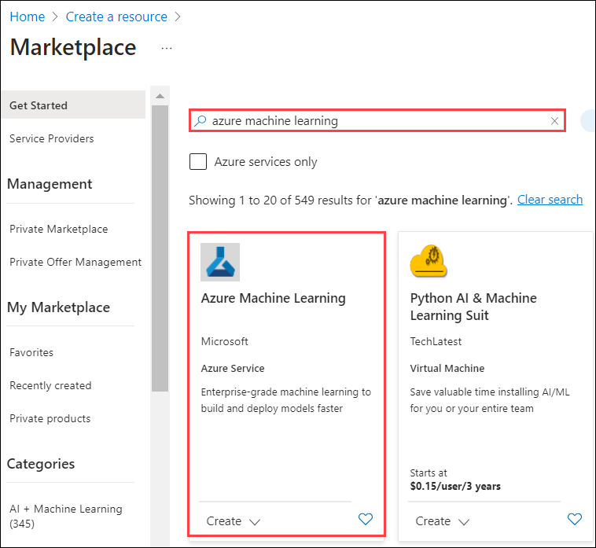
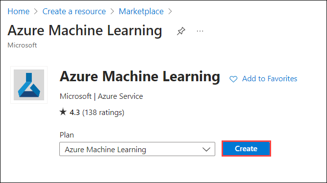
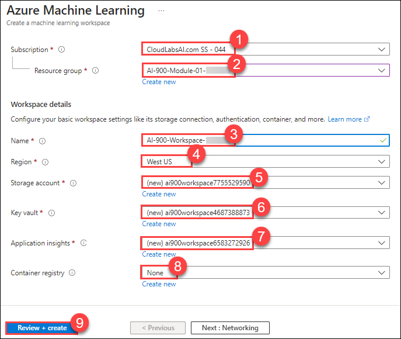
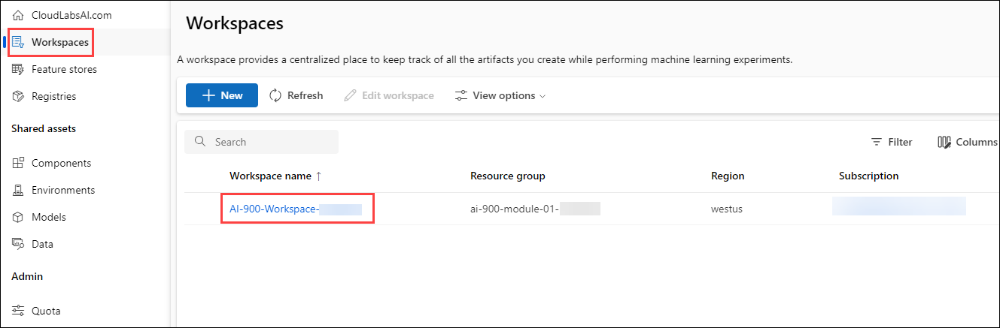
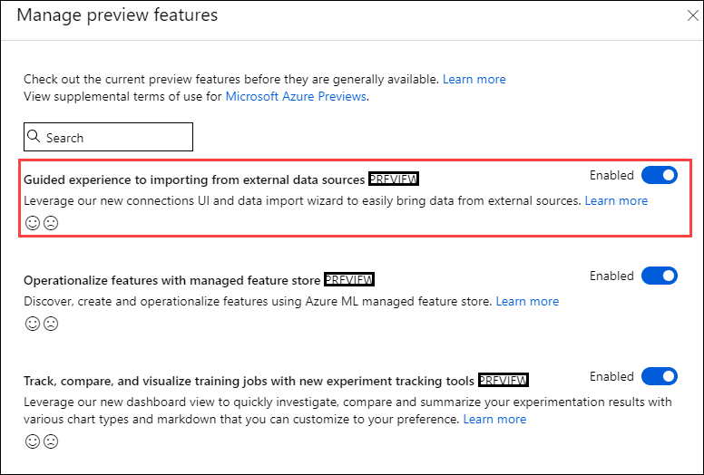
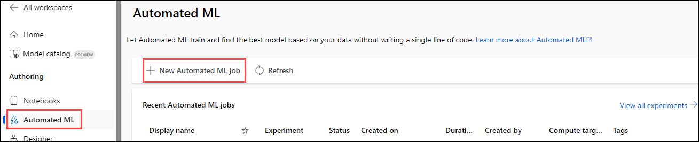
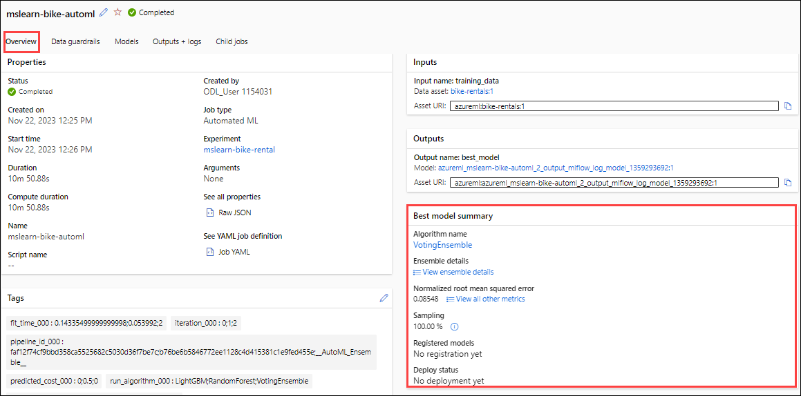

# Module 01: Explore Automated Machine Learning in Azure Machine Learning

## Lab overview

In this exercise, you'll use the automated machine learning feature in **Azure Machine Learning** to train and evaluate a machine learning model. You'll then deploy and test the trained model.

>**Important**
>At this time, it is possible to author and deploy a model as a web service in the Azure Machine Learning Studio, but not to test it in the Studio. Therefore, all but the last section of steps before clean-up are possible to complete. We will update as this changes.

## Lab objectives

In this lab, you will perform:

- Creating an *Azure Machine Learning workspace* resource
- Use automated machine learning to train a model

## Estimated timing: 60 minutes

## Architecture Diagram

 

## Exercise 1: Explore Automated Machine Learning in Azure Machine Learning

### Task 1: Create an Azure Machine Learning workspace

1. Select **+ Create a resource**, search for Machine Learning.

    

2. In the Marketplace page search for **Azure Machine Learning** and Select **Azure Machine Learning**.
 
   

3. On **Azure Machine Learning** Page Click on **Create**.

   
  
4. Create a new **Azure Machine Learning** resource with an *Azure Machine Learning* plan. Use the following settings:

    - **Subscription**: Use existing Azure subscription. **(1)**
    - **Resource group**: Select **AI-900-Module-01-<inject key="DeploymentID" enableCopy="false" />**
    - **Workspace name**: Give name **AI-900-Workspace-<inject key="DeploymentID" enableCopy="false" /> (3)**
    - **Region**: Select <inject key="location" enableCopy="false" /> **(4)**
    - **Storage account**: Note the default new storage account that will be created for your workspace. **(5)**
    - **Key vault**: Note the default new key vault that will be created for your workspace. **(6)**
    - **Application insights**: Note the default new application insights resource that will be created for your workspace. **(7)**
    - **Container registry**: None (one will be created automatically the first time you deploy a model to a container) **(8)**

5. Select **Review + create (9)**.

      

6. After successfully completing the validation process, click on the "Create" button located in the lower left corner of the page.
   
7. Wait for deployment to complete(it can take a few minutes), and then click on the **Go to resource** button, this will take you to your workspace resource.

8. Select **Launch studio** (or open a new browser tab and navigate to [https://ml.azure.com](https://ml.azure.com?azure-portal=true), and sign into Azure Machine Learning studio using your Microsoft account). Close any messages that are displayed.

9. In Azure Machine Learning studio, you should see your newly created workspace. If not, select **All workspaces** in the left-hand menu and then select the workspace you just created.
    

## Enable preview features

Some features of Azure Machine Learning are in preview, and need to be explicitly enabled in your workspace.

1. In Azure Machine Learning Studio, click on **manage preview features** (the loud speaker icon - &#128363;).

     

1. Enable the following preview feature:

     

### Task 2: Use automated machine learning to train a model

Automated machine learning enables you to try multiple algorithms and parameters to train multiple models, and identify the best one for your data. In this exercise, you'll use a dataset of historical bicycle rental details to train a model that predicts the number of bicycle rentals that should be expected on a given day, based on seasonal and meteorological features.

> **Citation**: *The data used in this exercise is derived from [Capital Bikeshare](https://www.capitalbikeshare.com/system-data) and is used in accordance with the published data [license agreement](https://www.capitalbikeshare.com/data-license-agreement)*.

1. In [Azure Machine Learning studio](https://ml.azure.com?azure-portal=true), view the **Automated ML** page (under **Authoring**).

     

1. Create a new Automated ML job by selecting **+ New Automated ML job** with the following settings, using **Next** as required to progress through the user interface:

    **Basic settings**:

    - **Job name**: mslearn-bike-automl
    - **New experiment name**: mslearn-bike-rental
    - **Description**: Automated machine learning for bike rental prediction
    - **Tags**: *none*

   **Task type & data**:

    - **Select task type**: Regression
    - **Select data**: Select **+ Create** to create a new data with the following settings:
        - **Data type**:
            - **Name**: bike-rentals
            - **Description**: Historic bike rental data
            - **Type**: Tabular and then select **Next**
        - **Data source**:
            - Select **From web files** and then select **Next**
        - **Web URL**:
            - **Web URL**: `https://aka.ms/bike-rentals`
            - **Skip data validation**: *do not select* and then select **Next**
        - **Settings**:
            - **File format**: Delimited
            - **Delimiter**: Comma
            - **Encoding**: UTF-8
            - **Column headers**: Only first file has headers
            - **Skip rows**: None
            - **Dataset contains multi-line data**: *do not select* and then select **Next**
        - **Schema**:
            - Include all columns other than **Path** and then select **Next**
            - Review the automatically detected types

        Select **Create**. After the dataset is created, select the **bike-rentals** dataset to continue to submit the Automated ML job. Select **Next**

    **Task settings**:

    - **Task type**: Regression
    - **Data**: bike-rentals
    - **Target column**: rentals (integer)
    - **View additional configuration settings**:
        - **Primary metric**: Normalized root mean squared error
        - **Explain best model**: *Unselected*
        - **Use all supported models**: <u>Un</u>selected. *You'll restrict the job to try only a few specific algorithms.*
        - **Allowed models**: *Select only **RandomForest** and **LightGBM** — normally you'd want to try as many as possible, but each model added increases the time it takes to run the job.*
    - **Limits**: *Expand this section*
        - **Max trials**: 3
        - **Max concurrent trials**: 3
        - **Max nodes**: 3
        - **Metric score threshold**: 0.085 (*so that if a model achieves a normalized root mean squared error metric score of 0.085 or less, the job ends.*)
        - **Experiment Timeout**: 15
        - **Iteration timeout**: 15
        - **Enable early termination**: *Selected*
    - **Validation and test**:
        - **Validation type**: Train-validation split
        - **Percentage validation of data**: 10
        - **Test dataset**: None and then select **Next**

    **Compute**:
    - **Select compute type**: Serverless
    - **Virtual machine type**: CPU
    - **Virtual machine tier**: Dedicated
    - **Virtual machine size**: Standard_DS3_V2
    - **Number of instances**: 1 and then select **Next**

1. Select **Submit training job**. It starts automatically.

1. Wait for the job to finish. It might take a while — now might be a good time for a coffee break!

  ## Review the best model

When the automated machine learning job has completed, you can review the best model it trained.

1. On the **Overview** tab of the automated machine learning job, note the best model summary.

    

    > **Note**
    > You may see a message under the status "Warning: User specified exit score reached...". This is an expected message. Please continue to the next step.
  
1. Select the text under **Algorithm name** for the best model to view its details.

1. Select the **Metrics** tab and select the **residuals** and **predicted_true** charts if they are not already selected. 

    Review the charts which show the performance of the model. The **residuals** chart shows the *residuals* (the differences between predicted and actual values) as a histogram. The **predicted_true** chart compares the predicted values against the true values.

### Task 3: Deploy the model

1. On the **Model** tab for the best model trained by your automated machine learning job, select **Deploy** and use the **Web service** option to deploy the model with the following settings:
    - **Name**: predict-rentals  **(1)**
    - **Description**: Predict cycle rentals **(2)**
    - **Compute type**: Azure Container Instance **(3)**
    - **Enable authentication**: *Selected* **(4)**
    - Select **Deploy**

     

1. Wait for the deployment to start - this may take a few seconds. The **Deploy status** for the **predict-rentals** endpoint will be indicated in the main part of the page as *Running*.
1. Wait for the **Deploy status** to change to *Succeeded*. This may take 5-10 minutes.
   
> **Congratulations** on completing the task! Now, it's time to validate it. Here are the steps:
 
- Navigate to the Lab Validation Page, from the upper right corner in the lab guide section.
- Hit the Validate button for the corresponding task. If you receive a success message, you can proceed to the next task. 
- If not, carefully read the error message and retry the step, following the instructions in the lab guide.
- If you need any assistance, please contact us at labs-support@spektrasystems.com. We are available 24/7 to help you out.

### Review
In this lab, you have created an Azure Machine Learning workspace resource, and use automated machine learning to train a model and deploy it
  
## You have successfully completed this lab.
