# Module 03:  Analyze images in Vision Studio  

## Lab overview

**Azure AI Vision** includes numerous capabilities for understanding image content and context and extracting information from images. Azure AI Vision Studio allows you to try out many of the capabilities of image analysis. 

In this exercise, you will use Vision Studio to analyze images using the built-in try-it-out experiences. Suppose the fictitious retailer *Northwind Traders* has decided to implement a "smart store", in which AI services monitor the store to identify customers requiring assistance, and direct employees to help them. By using Azure AI Vision, images taken by cameras throughout the store can be analyzed to provide meaningful descriptions of what they depict

## Lab objectives
In this lab, you will perform:
  - Create an Azure AI services resource
  - Connect Azure AI Service Resource to Vision Studio
  - Image Analysis with Azure AI Vision Services
  - Tagging images
  - Object detection

## Estimated timing: 60 minutes

## Architecture Diagram

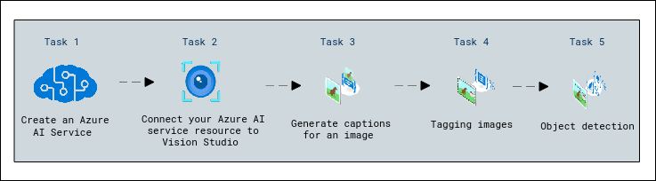

## Exercise 1: Analyze images in Vision Studio

### Task 1: Create an *Azure AI services* resource

You can use Azure AI Vision's image analysis capabilities with an **Azure AI services** multi-service resource. If you haven't already done so, create an **Azure AI services** resource in your Azure subscription.

1. In the azure portal, click the **&#65291;Create a resource** button and search for *Azure AI services*. Select **create** an **Azure AI services** plan. You will be taken to a page to create an Azure AI services resource. Configure it with the following settings:

   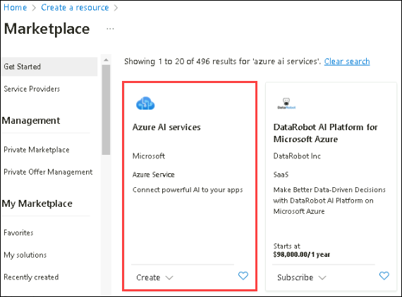
   
    - **Subscription (1)**: Use the existing Azure subscription.
    - **Resource group (2)**: **AI-900-Module-03-<inject key="DeploymentID" enableCopy="false" />**
    - **Region (3)**: Select **<inject key="location" enableCopy="false"/>**
    - **Name (4)**: Enter **visionimageai<inject key="DeploymentID" enableCopy="false"/>**
    - **Pricing tier (5)**:Select **Standard S0**.
    - **By checking this box I acknowledge that I have read and understood all the terms below**: *Selected*.

1. Select **Review + create** then **Create** and wait for deployment to complete.

### Task 2: Connect your Azure AI service resource to Vision Studio

Next, connect the Azure AI service resource you provisioned above to Vision Studio.

1. In another browser tab, navigate to [Vision Studio](https://portal.vision.cognitive.azure.com?azure-portal=true).

1. Sign in with your account and making sure you are using the same directory as the one where you have created your Azure AI services resource.

   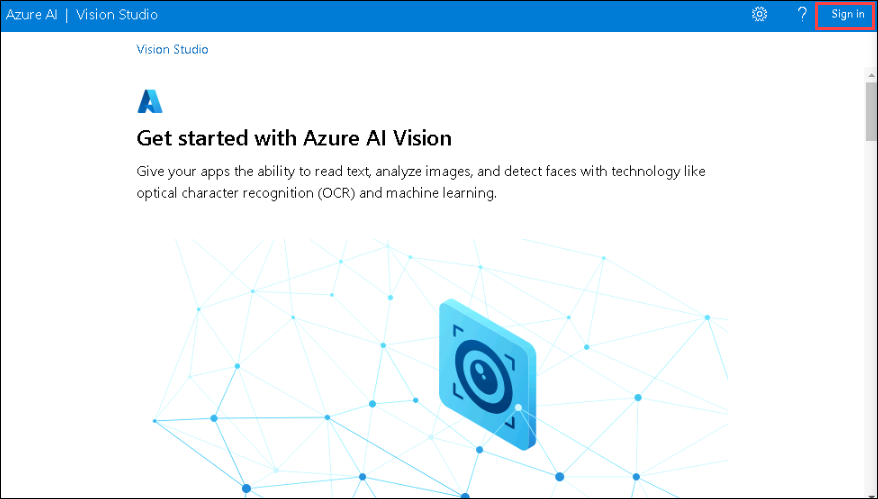

1. On the Vision Studio home page, select **View all resources** under the **Getting started with Vision** heading.

    

1. On the **Select a resource to work with** page, hover your mouse cursor over the resource you created above in the list and then check the box to the left of the resource name, then select **Select as default resource**.

   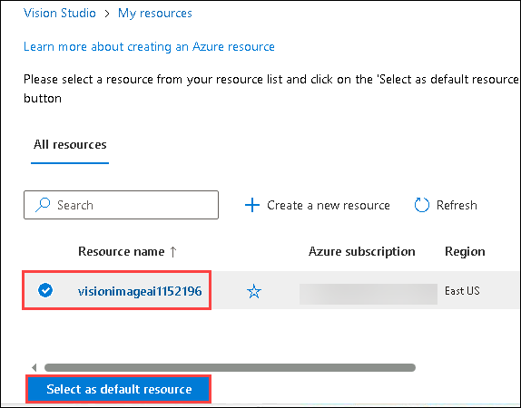

    > **Note** : If your resource is not listed, you may need to **Refresh** the page.

1. Close the settings page by selecting the "x" at the top right of the screen.

### Task 3: Generate captions for an image

Now you are ready to use Vision Studio to analyze images taken by a camera in the *Northwind Traders* store.

Let's look at the image captioning functionality of Azure AI Vision. Image captions are available through the **Caption** and **Dense Captions** features.

1. In a web browser, navigate to [Vision Studio](https://portal.vision.cognitive.azure.com?azure-portal=true).

1. On the **Getting started with Vision** landing page, select the **Image analysis** tab and then select the **Add captions to images** tile.

    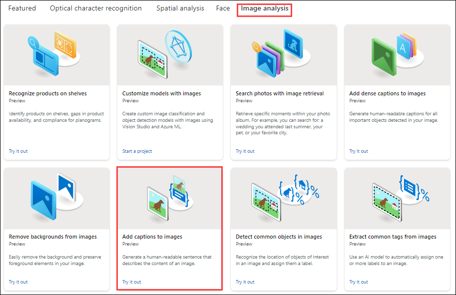

1. Under the **Try It Out** subheading, acknowledge the resource usage policy by reading and checking the box.  

1. Copy this link and paste it into the browser [**https://aka.ms/mslearn-images-for-analysis**](https://aka.ms/mslearn-images-for-analysis) to download **image-analysis.zip**. Open the folder on your computer and locate the file named **store-camera-1.jpg**; which contains the following image:

    

1. Unzip the file and upload the **store-camera-1.jpg** image by dragging it to the **Drag and drop files here** box, or by browsing to it on your file system.

1. Observe the generated caption text, visible in the **Detected attributes** panel to the right of the image.

    The **Caption** functionality provides a single, human-readable English sentence describing the image's content.

     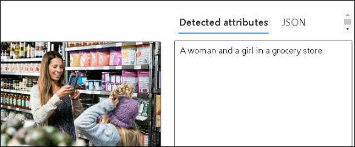

1. Next, use the same image to perform **Dense captioning**. Return to the **Vision Studio** home page, and as you did before, select the **Image analysis** tab, then select the **Dense captioning** tile.

   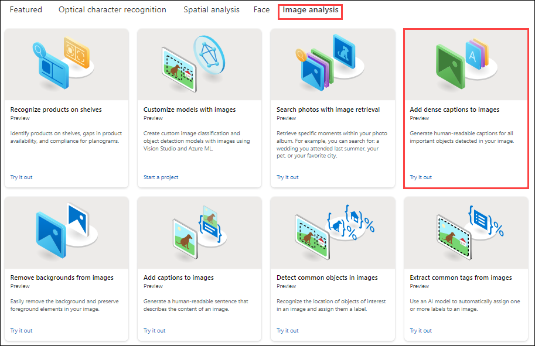

    The **Dense Captions** feature differs from the **Caption** capability in that it provides multiple human-readable captions for an image, one describing the image's content and others, each covering the essential objects detected in the picture. Each detected object includes a bounding box, which defines the pixel coordinates within the image associated with the object.

1. upload the **store-camera-1.jpg** image by dragging it to the **Drag and drop files here** box, or by browsing to it on your file system . Hover over one of the captions in the **Detected** attributes list and observe what happens within the image.

    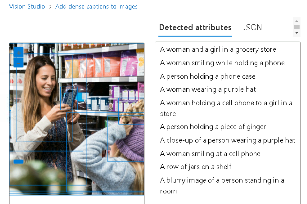

    Move your mouse cursor over the other captions in the list, and notice how the bounding box shifts in the image to highlight the portion of the image used to generate the caption.

## Task 4: Tagging images

The next feature you will try is the **Extract Tags** functionality. Extract tags is based on thousands of recognizable objects, including living beings, scenery, and actions.

1. Return to the home page of Vision Studio, then select the **Extract common tags from images** tile under the **Image analysis** tab.

   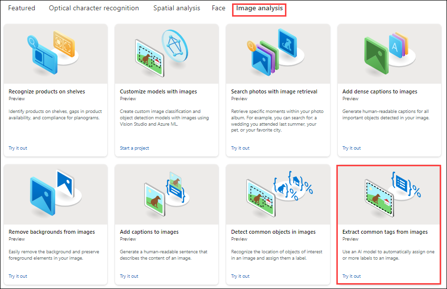

3. In the **Choose your language**, select **English** or a language of your preference. Upload the **store-camera-2.jpg** image by dragging it to the **Drag and drop files here** box, or by browsing it on your file system.

   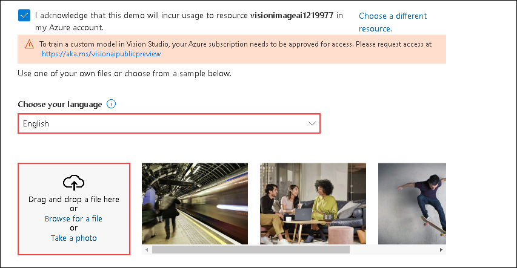

   >**Note:** You can ignore the warning.

6. Review the list of tags extracted from the image and the confidence score for each in the detected attributes panel. Here the confidence score is the likelihood that the text for the detected attribute describes what is actually in the image. Notice in the list of tags that it includes not only objects, but actions, such as *shopping*, *selling*, and *standing*.

    .png)

### Task 5: Object detection

In this task, you use the **Object detection** feature of Image Analysis. Object detection detects and extracts bounding boxes based on thousands of recognizable objects and living beings.

1. Return to the home page of Vision Studio, then select the **Detect common objects in images** tile under the **Image analysis** tab.

   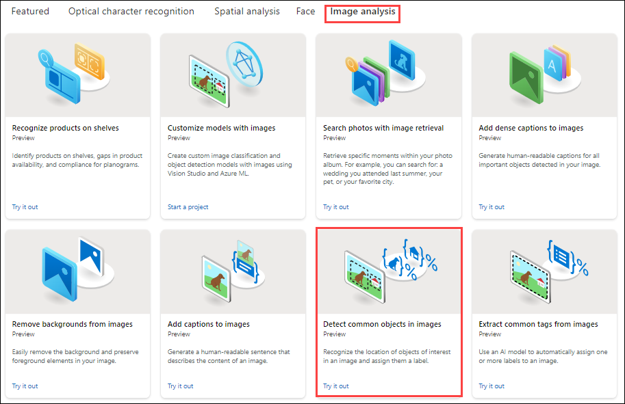

1. Open the folder containing the images you downloaded and locate the file named **store-camera-3.jpg**, which looks like this:

    

1. Upload the **store-camera-3.jpg** file.

1. In the **Detected attributes** box, observe the list of detected objects and their confidence scores.

1. Hover your mouse cursor over the objects in the **Detected attributes** list to highlight the object's bounding box in the image.

1. Move the **Threshold value** slider until a value of 74 is displayed to the right of the slider. Observe what happens to the objects in the list. The threshold slider specifies that only objects identified with a confidence score or probability greater than the threshold should be displayed.

     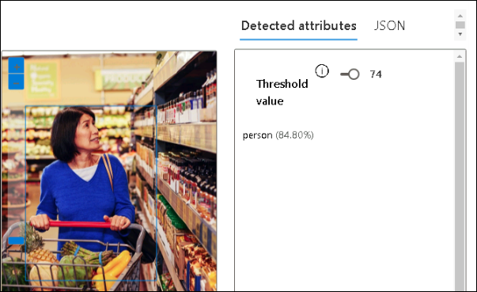

> **Congratulations** on completing the task! Now, it's time to validate it. Here are the steps:
 
- Navigate to the Lab Validation Page, from the upper right corner in the lab guide section.
- Hit the Validate button for the corresponding task. If you receive a success message, you can proceed to the next task. 
- If not, carefully read the error message and retry the step, following the instructions in the lab guide.
- If you need any assistance, please contact us at labs-support@spektrasystems.com. We are available 24/7 to help you out.

## Learn more

To learn more about what you can do with this service, see the [Azure AI Vision page](https://learn.microsoft.com/azure/ai-services/computer-vision/overview).

### Review
In this lab, you have created an Azure AI Service resource, connected it to the vision studio, performed image analysis, tagging images and detected objects in the studio

## You have successfully completed this lab.
