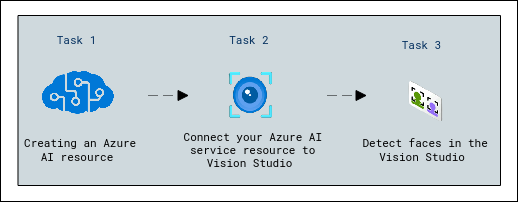
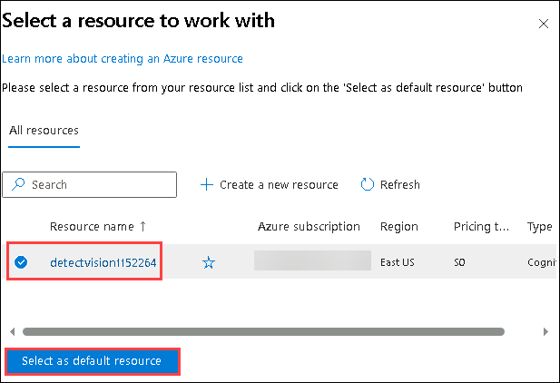
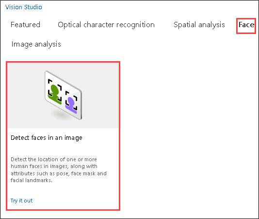
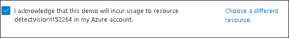
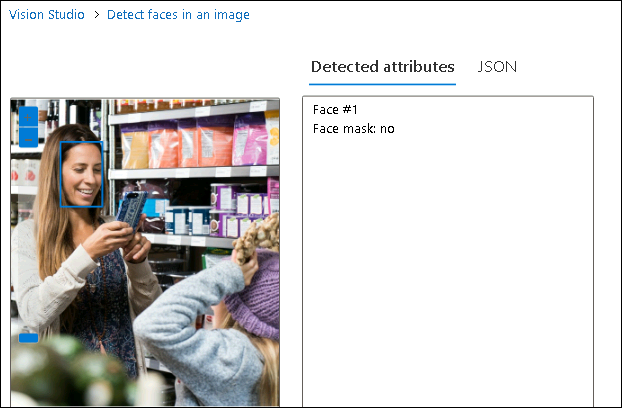

# Module 04: Detect faces in Vision Studio

## Lab overview

Vision solutions often require AI to be able to detect human faces. Suppose the fictitious retail company Northwind Traders wants to locate where customers are standing in a store to best assist them. One way to accomplish this is to determine if there are any faces in the images, and if so, to return the bounding box coordinates that show their location.

To test the face detection capabilities of the Azure AI Face service, you will use [Azure Vision Studio](https://portal.vision.cognitive.azure.com/). This is a UI-based platform that lets you explore Azure AI Vision features without needing to write any code.

## Lab objectives
In this lab, you will perform:
- Create an Azure AI services resource
- Connect Azure AI Service Resource to Vision Studio
- Detect faces in the Vision Studio

## Estimated timing: 30 minutes

## Architecture Diagram

## Exercise 1:  Detect faces in Vision Studio 

### Task 1:  Create an *Azure AI services* resource

You can use Azure AI Face service with an **Azure AI services** multi-service resource. If you haven't already done so, create an **Azure AI services** resource in your Azure subscription.

1. In the azure portal, click the **&#65291;Create a resource** button and search for *Azure AI services*. Select **create** an **Azure AI services** plan. You will be taken to a page to create an Azure AI services resource. Configure it with the following settings:
   
    - **Subscription (1)**: Use the existing Azure subscription.
    - **Resource group (2)**: **AI-900-Module-04-<inject key="DeploymentID" enableCopy="false" />**
    - **Region (3)**: Select **<inject key="location" enableCopy="false"/>**
    - **Name (4)**: Enter **detectvision<inject key="DeploymentID" enableCopy="false"/>**
    - **Pricing tier (5)**:Select **Standard S0**.
    - **By checking this box I acknowledge that I have read and understood all the terms below**: *Selected*.

1. Select **Review + create** then **Create** and wait for deployment to complete.

> **Congratulations** on completing the task! Now, it's time to validate it. Here are the steps:
 
- Navigate to the Lab Validation Page, from the upper right corner in the lab guide section.
- Hit the Validate button for the corresponding task. If you receive a success message, you can proceed to the next task. 
- If not, carefully read the error message and retry the step, following the instructions in the lab guide.
- If you need any assistance, please contact us at labs-support@spektrasystems.com. We are available 24/7 to help you out.
  
### Task 2: Connect your Azure AI service resource to Vision Studio

Next, connect the Azure AI services resource you provisioned above to Vision Studio.

1. In another browser tab, navigate to [Vision Studio](https://portal.vision.cognitive.azure.com?azure-portal=true).

1. Sign in with your account and making sure you are using the same directory as the one where you have created your Azure AI services resource.

1. On the Vision Studio home page, select **View all resources** under the **Getting started with Vision** heading.

    

1. On the **Select a resource to work with** page, hover your mouse cursor over the resource you created above in the list and then check the box to the left of the resource name, then select **Select as default resource**.

    > **Note** : If your resource is not listed, you may need to **Refresh** the page.

    
   
1. Close the settings page by selecting the "x" at the top right of the screen.

### Task 3:   Detect faces in the Vision Studio 

1. In a web browser, navigate to [Vision Studio](https://portal.vision.cognitive.azure.com?azure-portal=true).

1. On the **Getting started with Vision** landing page, select the **Face** tab and then select the **Detect Faces in an image** tile.

   

1. Under the **Try It Out** subheading, acknowledge the resource usage policy by reading and checking the box.

   

1. Select each of the sample images and observe the face detection data that is returned.

1. Now let's try with some of our own images. Select [**https://aka.ms/mslearn-detect-faces**](https://aka.ms/mslearn-detect-faces) to download **detect-faces.zip**. Then open the folder on your computer.

1. Unzip the file and locate the file named **store-camera-1.jpg**; which contains the following image:

    

1. Upload **store-camera-1.jpg** and review the face detection details that are returned.

   

1. Locate the file named **store-camera-2.jpg**; which contains the following image:

    

1. Upload **store-camera-2.jpg** and review the face detection details that are returned.

1. Locate the file named **store-camera-3.jpg**; which contains the following image:

    

1. Upload **store-camera-2.jpg** and review the face detection details that are returned. Notice how Azure AI Face can detect faces that are partially obscured. 

In this exercise you have explored how Azure AI services can detect faces in images. If you have time, feel free to try the sample images or some of your own images.

## Learn more

To learn more about what you can do with this service, see the [Azure AI Face service page](https://learn.microsoft.com/azure/ai-services/computer-vision/overview-identity).

### Review
In this lab, you have created an Azure AI Service resource, connected it to the vision studio and detect faces in the Studio 
  
## You have successfully completed this lab.
