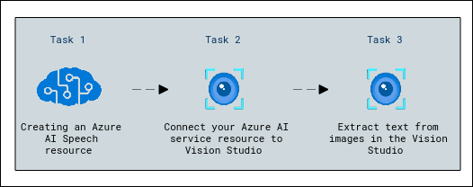
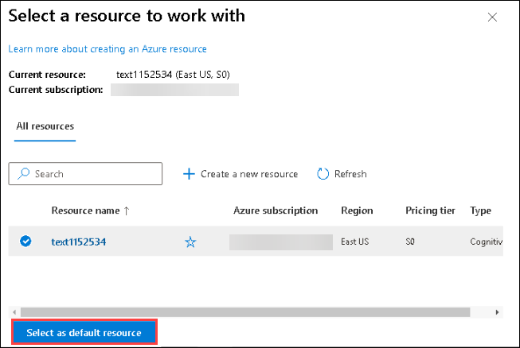

# Module 05: Read text in Vision Studio

## Lab overview

In this exercise you'll use Azure AI service to explore the optical character recognition capabilities of Azure AI Vision. You'll use Vision Studio to experiment with extracting text from images, without having to write any code.

A common computer vision challenge is to detect and interpret text embedded within an image. This is known as optical character recognition (OCR). In this exercise you’ll use an Azure AI services resource, which includes Azure AI Vision services. You'll then use Vision Studio to try out OCR with different types of images.

## Lab objectives

In this lab, you will perform:

- Creating an *Azure AI Speech* resource
- Connect your Azure AI service resource to Vision Studio
- Extract text from images in the Vision Studio

## Estimated timing: 30 minutes

# Architecture Diagram

# Exercise 1: Read text in Vision Studio
## Task 1: Create an *Azure AI services* resource

You can use Azure AI Vision's OCR capabilities with an **Azure AI services** multi-service resource. If you haven't already done so, create an **Azure AI services** resource in your Azure subscription.

1. In another browser tab, open the Azure portal at [https://portal.azure.com](https://portal.azure.com?azure-portal=true)

    - **Email/Username:** <inject key="AzureAdUserEmail"></inject>
    
    - **Password:** <inject key="AzureAdUserPassword"></inject>
    
1. Select **Yes** when asked for **Stay signed in**
   
1. Click the **&#65291;Create a resource** button

    .png)

   and search for *Azure AI services*. Select **create** an **Azure AI services** plan. You will be taken to a page to create an Azure      AI services resource. Configure it with the following settings:
    - **Subscription**: *Your Azure subscription*.
    - **Resource group**: **AI-900-Module-05-<inject key="DeploymentID" enableCopy="false" />**
    - **Region**: Select **<inject key="location" enableCopy="false"/>**
    - **Name**: Enter **text<inject key="DeploymentID" enableCopy="false" />**
    - **Pricing tier**: *Standard S0.*
    - **By checking this box I acknowledge that I have read and understood all the terms below**: *Selected*.

1. Select **Review + create** then **Create** and wait for deployment to complete.

> **Congratulations** on completing the task! Now, it's time to validate it. Here are the steps:
 
- Navigate to the Lab Validation Page, from the upper right corner in the lab guide section.
- Hit the Validate button for the corresponding task. If you receive a success message, you can proceed to the next task. 
- If not, carefully read the error message and retry the step, following the instructions in the lab guide.
- If you need any assistance, please contact us at labs-support@spektrasystems.com. We are available 24/7 to help you out.
  
## Task 2: Connect your Azure AI service resource to Vision Studio

Next, connect the Azure AI services resource you provisioned above to Vision Studio.

1. In another browser tab, navigate to [Vision Studio](https://portal.vision.cognitive.azure.com?azure-portal=true).

1. Sign in with your account and making sure you are using the same directory as the one where you have created your Azure AI services resource.

   .png)

1. On the Vision Studio home page, select **View all resources** under the **Getting started with Vision** heading.

    .png)

1. On the **Select a resource to work with** page, hover your mouse cursor over the resource you created above in the list and then check the box to the left of the resource name, then select **Select as default resource**.

    > **Note** : If your resource is not listed, you may need to **Refresh** the page.

    

1. Close the settings page by selecting the "x" at the top right of the screen.

## Task 3: Extract text from images in the Vision Studio
    
1. In a web browser, navigate to [Vision Studio](https://portal.vision.cognitive.azure.com?azure-portal=true).

1. On the **Getting started with Vision** landing page, select **Optical character recognition**, and then the **Extract text from images** tile.

   .png)

1. Under the **Try It Out** subheading, acknowledge the resource usage policy by reading and checking the box.

   .png)

1. Select [**https://aka.ms/mslearn-ocr-images**](https://aka.ms/mslearn-ocr-images) to download **ocr-images.zip**. Then open the folder.

1. On the portal, select **Browse for a file** and navigate to the folder on your computer where you downloaded **ocr-images.zip**. Select **advert.jpg** and select **Open**.

   .png)

1. Now review what is returned:
    - In **Detected attributes**, any text found in the image is organized into a hierarchical structure of regions, lines, and words.
    - On the image, the location of text is indicated by a bounding box, as shown here:

       .png)

1. You can now try another image. Select **Browse for a file** and navigate to the folder where you saved the files from GitHub. Select **letter.jpg**.

   .jpg)

1. Review the results of the second image. It should return the text and bounding boxes of the text. If you have time, try **note.jpg** and **receipt.jpg**.

## Learn more

To learn more about what you can do with this service, see Azure AI Vision's documentation on [optical character recognition](https://learn.microsoft.com/azure/ai-services/computer-vision/overview-ocr).

### Review
In this lab, you have created an azure AI speech resource, connected it to the vision studio and extracted text from images in the studio.
  
## You have successfully completed this lab.
