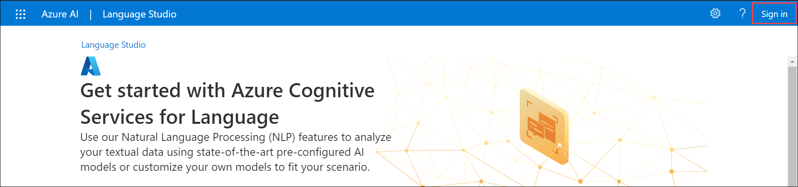
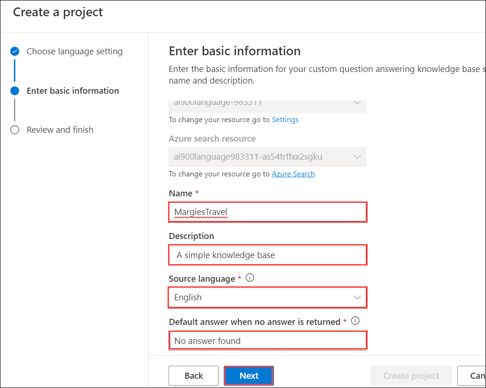
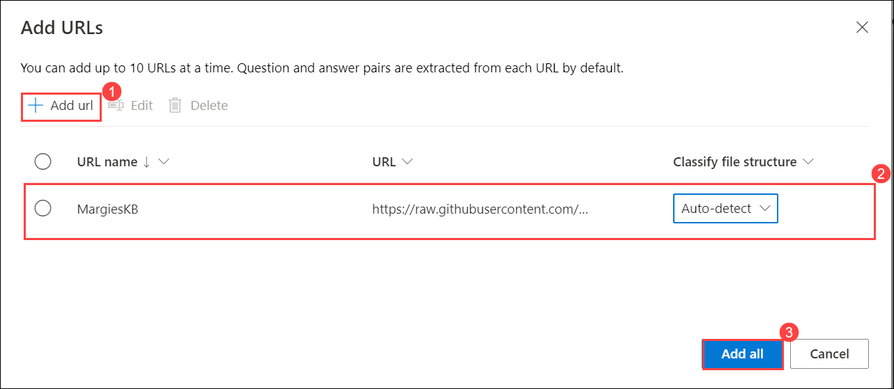
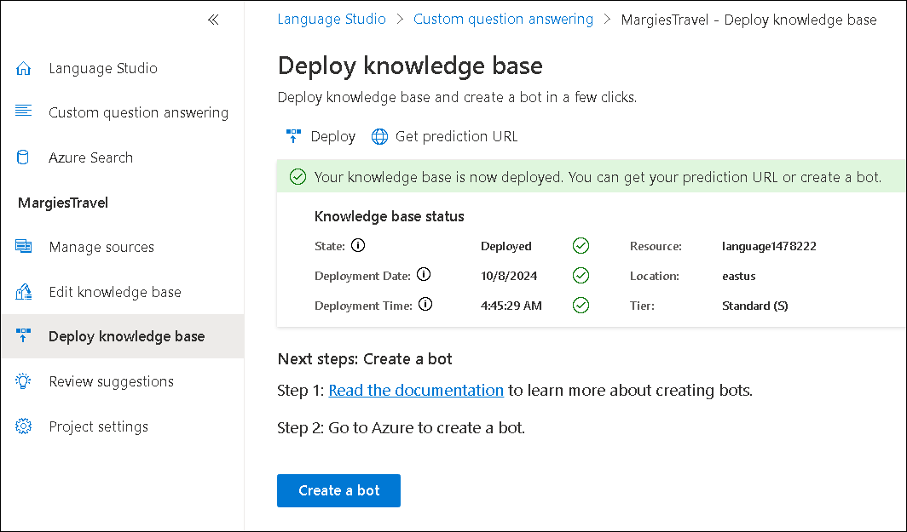

# Module 07: Use Question Answering with the Language Studio

## Lab overview
In this exercise you will use Language Studio to create and train a knowledge base of question and answers. Content for the knowledge base will come from an existing FAQ page from the web site of Margie’s Travel, a fictitious travel agency. You will then use Language Studio to see how it would work when used by customers.

Azure AI Language includes *question answering* capabilities, which you will use to create a knowledge base. Knowledge bases can be created either by entering question and answer pairs manually, or from an existing document or web page. Margie’s Travel wants to use their existing FAQ document.

The Language service's question answering feature enables you to quickly create a knowledge base, either by entering question and answer pairs or from an existing document or web page. It can then use some built-in natural language processing capabilities to interpret questions and find appropriate answers.

## Lab objectives
In this lab, you will perform:

- Create a *Language* resource
- Create a new project
- Edit the knowledge base
- Train and test the knowledge base
- Create a bot for the knowledge base

## Estimated timing: 45 minutes

## Architecture Diagram

## Exercise 1: Use Question Answering model with Language Studio

### Task 1: Create a *Language* resource

To use question answering, you need a **Language** resource.

1. In azure portal, click the **&#65291;Create a resource** button, then search and select *Language service*. Select **create** a **Language service** plan. You will be taken to a page to **Select additional features**. Use the following settings:
    - **Select Additional Features**:
        - **Default features**: *Keep the default features*.
        - **Custom features**: *Select custom question answering*.
     - Select **Continue to create your resource**
       
       .png)

1. On the **Create Language** page, specify the following settings:
    - **Project Details**
        - **Subscription**: *Your Azure subscription*.
        - **Resource group**: Select **AI-900-Module-07-<inject key="DeploymentID" enableCopy="false" />**
    - **Instance Details**
        - **Region**: Select **<inject key="location" enableCopy="false"/>**      
        - **Name**: Enter **language<inject key="DeploymentID" enableCopy="false" />**
        - **Pricing tier**: S (1K Calls per minute)
    - **Custom question answering**
        - **Azure search region**: Select **<inject key="location" enableCopy="false"/>**
        - **Azure search pricing tier**: Free F (3 Indexes) - (*If this tier is not available, select Basic*)
    - **Responsible AI Notice**
        - **By checking this box I certify that I have reviewed and acknowledge the terms in the Responsible AI Notice**: *Selected*.

1. Select **Review and Create** and then select **Create**. Wait for the deployment of the Language service that will support your custom question answering knowledge base.

    > **Note**
    > If you have already provisioned a free-tier **Azure Cognitive Search** resource, your quota may not allow you to create another one. In which case, select a tier other than **Free F**.

### Task 2: Create a new project

1. In a new browser tab, open the Language Studio portal at [https://language.azure.com](https://language.azure.com?azure-portal=true)

1. Sign in using the following username and password.
    
    * Email/Username: <inject key="AzureAdUserEmail"></inject>
    
    * Password: <inject key="AzureAdUserPassword"></inject>
    

   
   
1. If prompted to select an Azure resource, ensure the following settings and click on **Done (5)**:
    - **Azure directory**: *The Azure directory containing your subscription*.
    - **Azure subscription**: *Your Azure subscription*.
    - **Resource type**: *Language*.
    - **Resource name**: *select the Language service resource you just created*

1. If you are ***not*** prompted to choose a language resource, it may be because you have multiple Language resources in your subscription; in which case:
   
    - On the bar at the top of the page, select **Settings (&#9881;)**.
           
    - On the **Settings** page, view the **Resources** tab.
       
    - Select the language resource you just created, and select **Switch resource**.
       
    - At the top of the page, select **Language Studio** to return to the Language Studio home page.

1. At the top of the Language Studio portal, in the **Create new** menu, select **Custom question answering**.

    .png)

1. On the **Choose language setting for the resource language-<inject key="DeploymentID" enableCopy="false" />** page, select **I want to select the language when I create a project in this resource** (1) and click **Next** (2).

    .png)

1. On the **Enter basic information** page, enter the following details and click **Next**:
    - **Language resource**: *choose your language resource* (**if not already chosen**).  
    - **Azure search resource**: *choose your Azure search resource* (**if not already chosen**).
    - **Name**: `MargiesTravel`
    - **Description**: `A simple knowledge base`
    - **Source language**: English
    - **Default answer when no answer is returned**: `No answer found`
      
      

1. On the **Review and finish** page, click **Create project**.

   
   
1. You will be taken to the **Manage sources** page. Select **&#65291;Add source** and select **URLs**.

   .png)
   
1. In the **Add URLs** box, select **+ Add url**. Provide the following details and select **Add all**:
    - **URL name**: `MargiesKB`
    - **URL**: `https://raw.githubusercontent.com/MicrosoftLearning/mslearn-ai-fundamentals/main/data/natural-language/margies_faq.docx`
    - **Classify file structure**: *Auto-detect*

     
      

### Task 3: Edit the knowledge base

Your knowledge base is based on the details in the FAQ document and some pre-defined responses. You can add custom question-and-answer pairs to supplement these.

1. Expand the left panel and select **Edit knowledge base**. Then select **+** to add a new question pair.
   
    .png)
   
1. In the **Add a new question answer pair** dialog box, in the **Question** type `Hello`, and in the **Answer** type `Hi`, then select **Done**.
1. Expand **Alternate questions** and select **+ Add alternate question**. Then enter `Hiya` as an alternative phrasing for "Hello".

   .png)
   
1. At the bottom of the **Question answer pairs** pane, select **Save** to save your knowledge base.

   .png)

### Task 4: Train and test the knowledge base

Now that you have a knowledge base, you can test it.

1. At the bottom of the **Question answer pairs** pane, select **Test** to test your knowledge base.

   .png)
   
1. In the test pane, at the bottom enter the message `Hi` and press enter. The response *Hi* should be returned.

   .png)
   
1. In the test pane, at the bottom enter the message `I want to book a flight` and press enter. An appropriate response from the FAQ should be returned.

    > **Note**
    > The response includes a *short answer* as well as a more verbose *answer passage* - the answer passage shows the full text in the FAQ document for the closest matched question, while the short answer is intelligently extracted from the passage. You can control whether the short answer is from the response by using the **Include short answer** checkbox at the top of the test pane.

1. Try another question, such as `How can I cancel a reservation?` and press enter.
1. When you're done testing the knowledge base, select **Test** to close the test pane.

### Task 5: Deploy your project

You can deploy the knowledge base as a client application to answer questions

1. In the left panel, select **Deploy knowledge base**. At the top of the page, select **Deploy**.

   .png)

1. A dialogue box will ask if you want to deploy the project. Select **Deploy**.
   
     
   
## Validation

   <validation step="11faa70c-17f5-4a89-8275-059ac6273139" />

> **Congratulations** on completing the task! Now, it's time to validate it. Here are the steps:
 
- Navigate to the Lab Validation Page, from the upper right corner in the lab guide section.
- Hit the Validate button for the corresponding task. If you receive a success message, you can proceed to the next task. 
- If not, carefully read the error message and retry the step, following the instructions in the lab guide.
- If you need any assistance, please contact us at labs-support@spektrasystems.com. We are available 24/7 to help you out.
  
## Learn more

- To learn more about the Question Answering service, view [the documentation](https://docs.microsoft.com/azure/cognitive-services/language-service/question-answering/overview).

### Review
In this lab, you have created an azure AI language resource, a new project, edited, trained and tested the knowledge base and created a bot for the knowledge base.
  
## You have successfully completed this lab.
