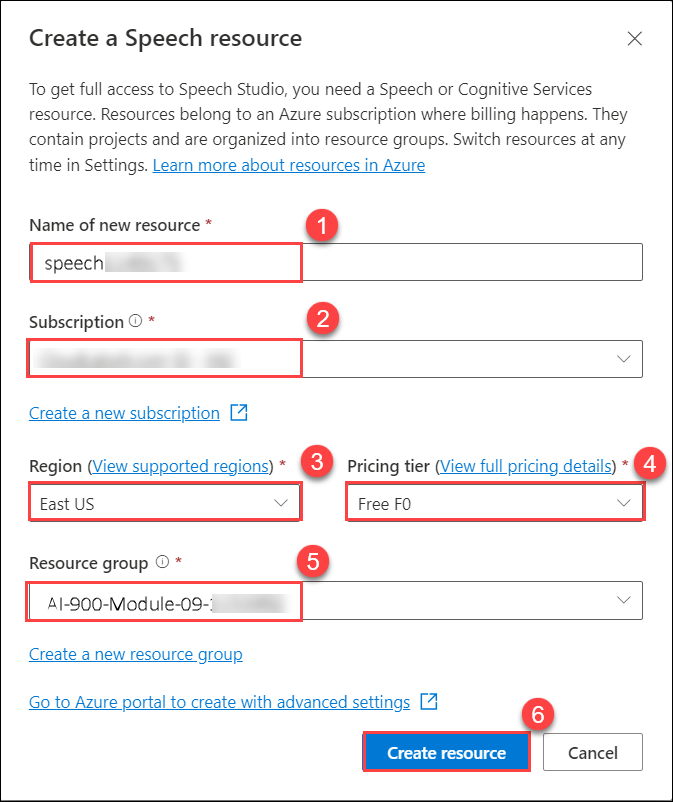
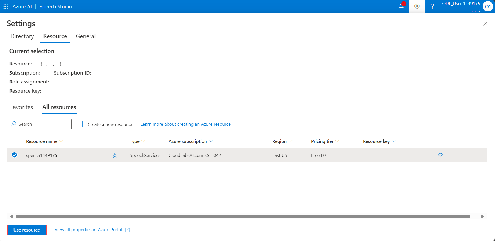
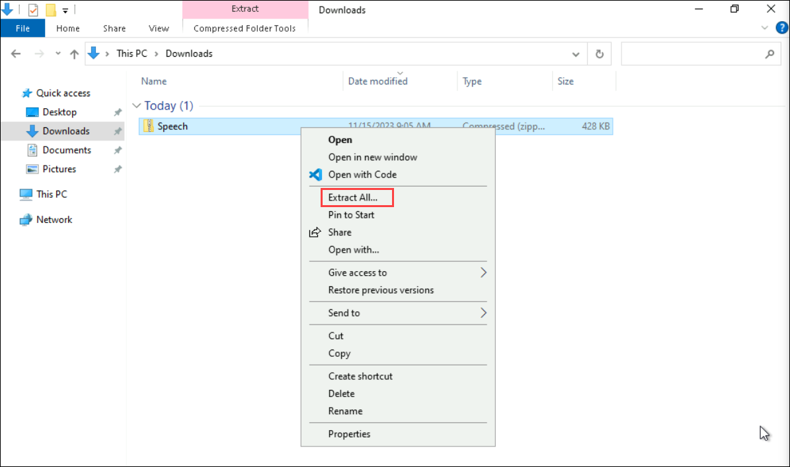
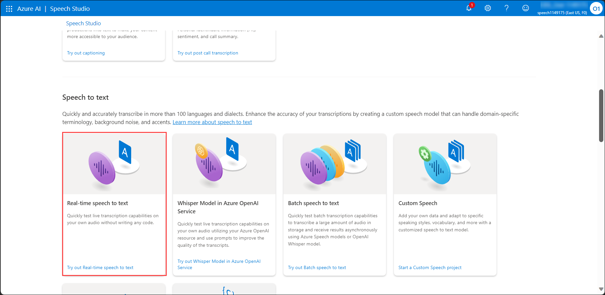
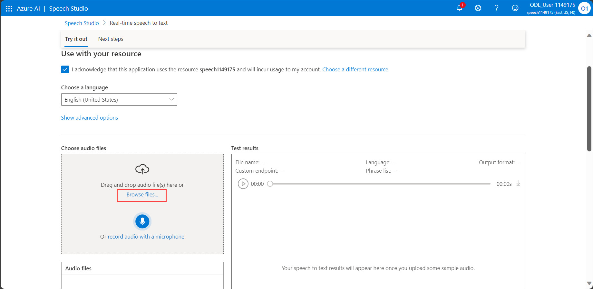
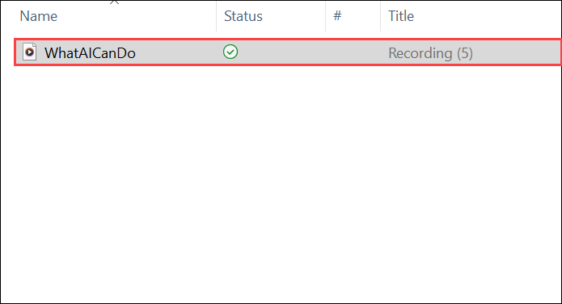

# Module 09: Explore Speech Studio

## Lab overview

In this exercise, you will try out the capabilities of Azure AI Speech using Azure AI Speech Studio. The **Azure AI Speech** service transcribes speech into text, and text into audible speech. You might use AI Speech to create an application that can transcribe meeting notes or generate text from the recording of interviews. 
 
## Lab objectives

In this lab, you will perform:

- Creating an *Azure AI Speech* resource
- Exploring speech to text in Speech Studio

## Estimated timing: 30 minutes

## Architecture Diagram

## Exercise 1: Explore Speech Studio

### Task 1: Create an **Azure AI Speech** resource

You can use the Speech service by creating either a **Speech** resource or an **Azure AI services** resource.

In this exercise, you will create an AI Speech resource, unless you already have a resource that you can use.

1. In another browser tab, open [Azure AI Speech Studio](https://speech.microsoft.com/), signing in with your following credentials:

  - **Email/Username:** <inject key="AzureAdUserEmail"></inject>

  - **Password:** <inject key="AzureAdUserPassword"></inject>

1. Select **Settings** then **Create a resource.** Configure it with the following settings:
    - **Name of new resource (1)**: Enter **speech<inject key="DeploymentID" enableCopy="false" />**
    - **Subscription (2)**: Select your **Your Azure subscription**.
    - **Region (3)**:  Select **<inject key="location" enableCopy="false"/>**
    - **Pricing tier (4)**: *Free FO (if available, otherwise select Standard S0).*
    - **Resource group (5)**: Select **ODL-AI-900-09-<inject key="DeploymentID" enableCopy="false" />-02**
    - Select **Create resource. (6)**

      

1.  Wait until the resource has been created.

1. Select **Use resource**. The Get started with Speech page is displayed.

    

### Task 2: Explore speech to text in Speech Studio

1. Select [**https://aka.ms/mslearn-speech-files**](https://aka.ms/mslearn-speech-files) to download **speech.zip**. 

1. Open the zip file in labvm and **Extract** the zip file.

   

1. On the Get started with Speech page, under *Speech* find *Real-time speech to text*. Select **Try out Real-time speech to text**.

    

1. Under *Choose audio files*, select **Browse files** .

    

1. Navigate to the folder where you saved the file. Select **WhatAICanDo.m4a** and then **Open**.

    

1. The Speech service transcribes and displays the text in real time. If you have audio on your computer, you can listen to the recording as the text is being transcribed.
1. Review the output, which should have successfully recognized and transcribed the audio into text.

    > **Note**
    > If you get an error message, wait a few minutes before trying again. It takes a little time for the Speech resource to be available for first use.

In this exercise you created an AI Speech resource in Speech Studio. You then used the Real-time speech to text service to transcribe an audio recording. You were able to see the text transcription being generated as the audio file was played.

## Learn more

This exercise demonstrated only some of the capabilities of the Speech service. To learn more about what you can do with this service, see the [Speech page](https://azure.microsoft.com/services/cognitive-services/speech-services).

### Review
In this lab, you have completed:

- Creating an *Azure AI Speech* resource
- Exploring speech to text in Speech Studio
  
## You have successfully completed this lab.