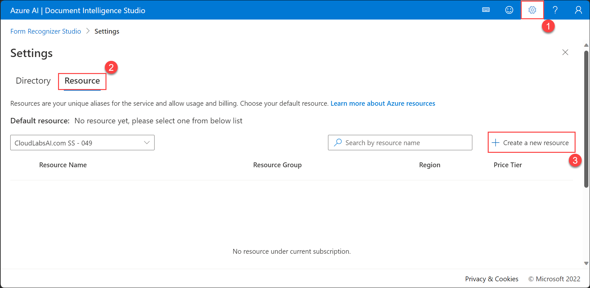
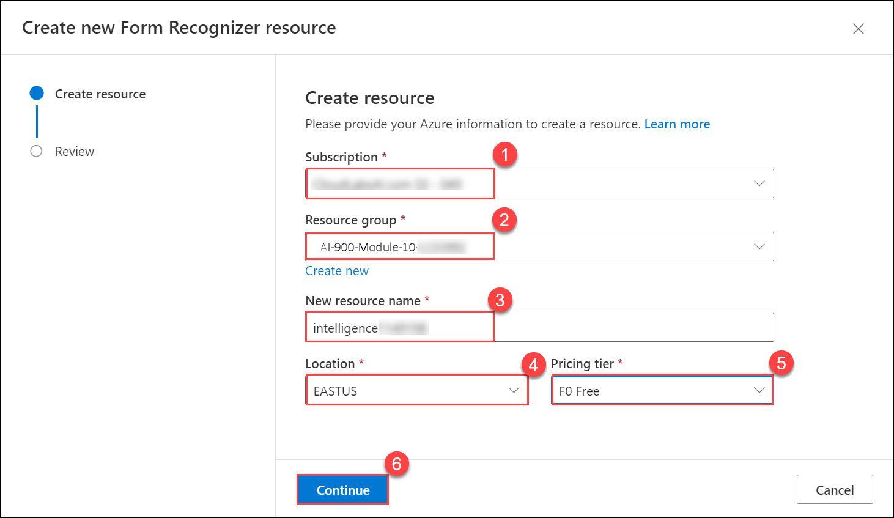
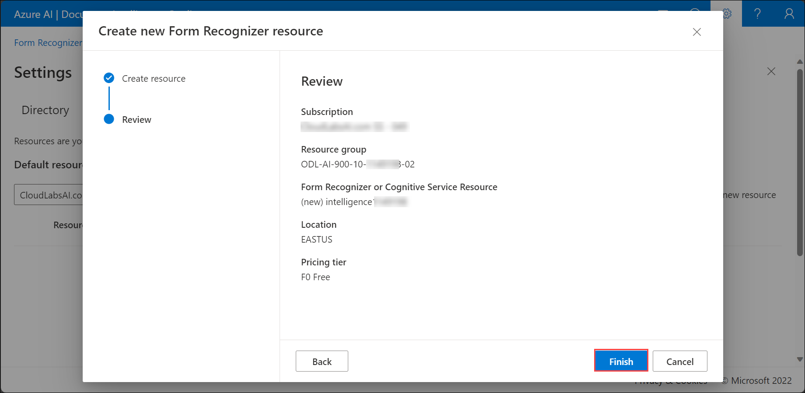
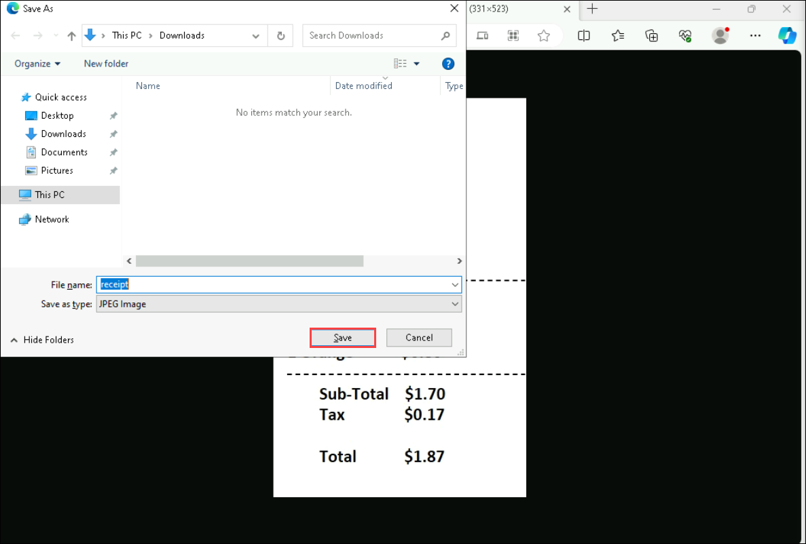
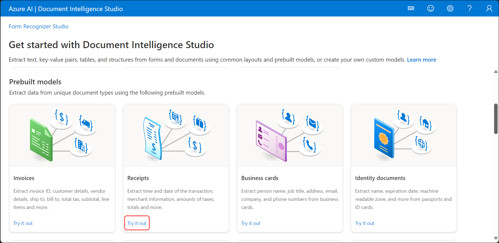
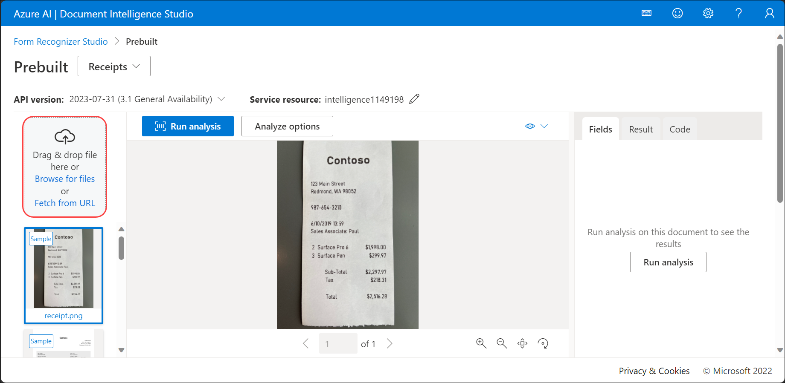
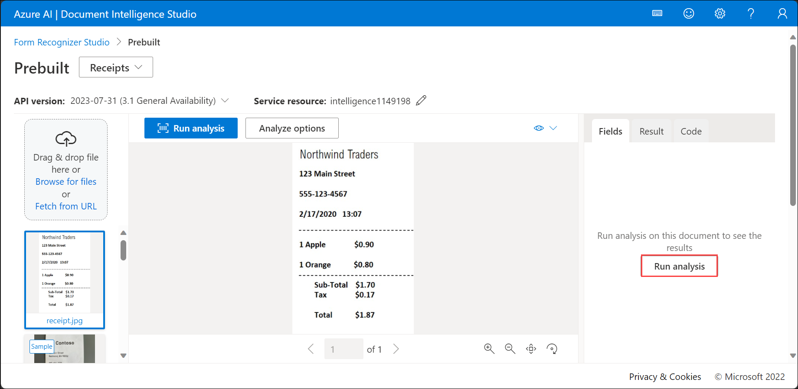
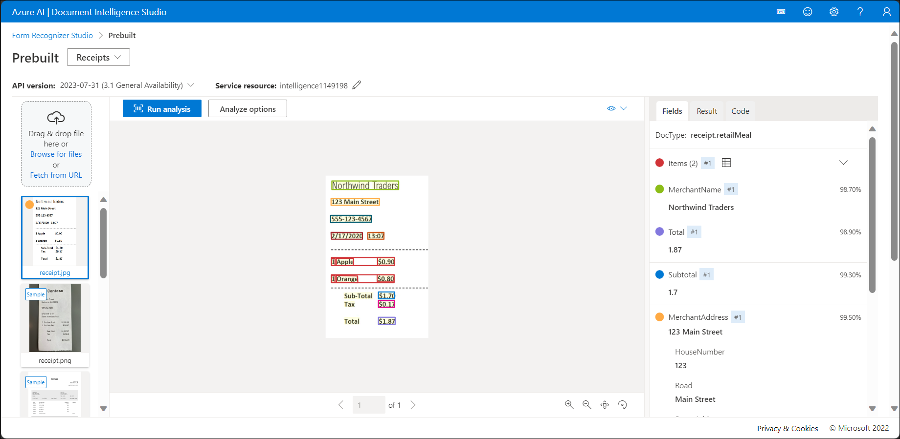

# Module 10: Extract form data in Document Intelligence Studio

## Lab overview
 
In this exercise, you'll take a look at a prebuilt model in Document Intelligence that is trained to recognize data for receipts. Azure AI Document Intelligence is able to analyze and extract information from forms and documents, then identify field names and data. 

How does Document Intelligence build upon optical character recognition (OCR)? While OCR can read printed or handwritten documents, OCR extracts text in an unstructured format which is difficult to store in a database or analyze. Document intelligence makes sense of the unstructured data by capturing the structure of the text, such as key/value pairs and information in tables. 

> **NOTE**
> Azure AI Document Intelligence is the new name for Azure Form Recognizer. You may still see Azure Form Recognizer in the Azure portal or Document Intelligence Studio.

# Lab objectives

In this lab, you will perform:

- Creating Document Intelligence resource
- Analyzing a receipt in Document Intelligence Studio

## Estimated timing: 30 minutes

## Architecture Diagram

## Exercise 1: Extract form data in Document 

### Task 1: Create Document Intelligence resource

You can use Azure AI Document Intelligence by creating either a *Document Intelligence* resource or an *Azure AI services* resource. In this exercise, you will create *Document Intelligence* resource, if you don’t already have one.

1. In another browser tab, open [Document Intelligence Studio](https://formrecognizer.appliedai.azure.com/studio), signing in with your following credentials:

  - **Email/Username:** <inject key="AzureAdUserEmail"></inject>

  - **Password:** <inject key="AzureAdUserPassword"></inject>

1. Select **Settings (1)** and select the **Resource (2)** tab. Select **Create a new resource (3)**.

   

1. On the Create resource dialog box, enter the following:
    - **Subscription (1)**: Select your **Existing Azure subscription**.
    - **Resource group (2)**: Select **ODL-AI-900-10-<inject key="DeploymentID" enableCopy="false" />-02**
    - **New resource namem(3)**:  Enter **intelligence<inject key="DeploymentID" enableCopy="false" />**
    - **Location (4)**: Select **<inject key="location" enableCopy="false"/>** 
    - **Pricing tier(5)**: *Free FO (if available, otherwise select Standard SO)*.
   - Select **Continue (6)** 

     

1. Click on **Finish**. Wait for the resource to be deployed.

   .

    >**Note**
    > If your resource is not yet displayed, you may need to **Refresh** the page.

Keep Document Intelligence Studio open.

> **Congratulations** on completing the task! Now, it's time to validate it. Here are the steps:
 
- Navigate to the Lab Validation Page, from the upper right corner in the lab guide section.
- Hit the Validate button for the corresponding task. If you receive a success message, you can proceed to the next task. 
- If not, carefully read the error message and retry the step, following the instructions in the lab guide.
- If you need any assistance, please contact us at labs-support@spektrasystems.com. We are available 24/7 to help you out.

### Task 2: Analyze a receipt in Document Intelligence Studio

You are now ready to analyze a receipt for the fictitious Northwind Traders retail company.

1. Select [**https://aka.ms/mslearn-receipt**](https://aka.ms/mslearn-receipt) to download and and save the sample document to your computer. Open the folder

   .

1. Select **Form Recognizer Studio** to return to the **Get Started with Document Intelligence Studio** page, and under Receipts select **Try it out**.

   

1. In the Prebuilt drop-down list, make sure that **Receipts** is selected.
1. Select **Browse for files** and navigate to the folder where you saved the picture. Select the picture of the receipt and then **Open**. The image appears on the left side of the screen.

    

1. On the right, select **Run analysis**.

    

1. When the analysis has run, the results are returned. Notice that the service has recognized specific data fields such as the merchant’s name, the address, phone number, and the transaction date and time, as well as the line items, subtotal, tax, and total amounts. Next to each field is a percentage probability that the field is correct.

   

> **Congratulations** on completing the task! Now, it's time to validate it. Here are the steps:
 
- Navigate to the Lab Validation Page, from the upper right corner in the lab guide section.
- Hit the Validate button for the corresponding task. If you receive a success message, you can proceed to the next task. 
- If not, carefully read the error message and retry the step, following the instructions in the lab guide.
- If you need any assistance, please contact us at labs-support@spektrasystems.com. We are available 24/7 to help you out.

## Learn more

This exercise demonstrated only some of the capabilities of the AI Document Intelligence service. To learn more about what you can do with this service, see the [Document Intelligence](https://learn.microsoft.com/azure/ai-services/document-intelligence/overview?view=doc-intel-3.1.0) page.

## Review

 In this exercise you have used the Document Intelligence Studio to create a Document Intelligence resource. You then used the service to analyze a receipt. From the results that were returned, you saw how Document Intelligence was able to identify specific fields, enabling data from everyday documents to be more easily processed. Before you close Document Intelligence Studio, why not try some of the sample receipts, including those in different languages?

