# Module 13: Explore the components and tools of the Azure AI Studio

## Lab overview
In this exercise, you use Azure AI Studio to create a project and explore a generative AI model

## Lab objectives

In this lab, you will perform:
- Task 1: Open Azure AI Studio
- Task 2: Create an Azure AI hub
- Task 3: Create a project
- Task 4: Deploy and test a model

## Estimated timing: 30 minutes

## Architecture Diagram

## Exercise 1: 

### Task 1: Open Azure AI Studio

1. In a web browser, open https://ai.azure.com and **Sign in** using your Azure credentials. The home page of Azure AI Studio looks similar to the following image:

   - **Email/Username:** <inject key="AzureAdUserEmail"></inject>
   - **Password:** <inject key="AzureAdUserPassword"></inject>

    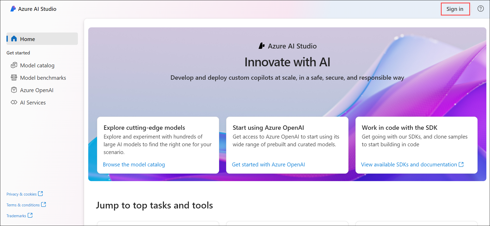

2. Review the information on the home page and view each of the tabs, noting the options to explore models and capabilities, create projects, and manage resources.

    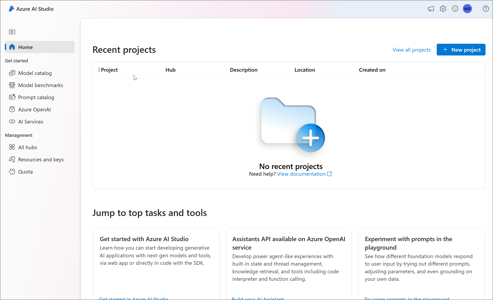

### Task 2: Create an Azure AI hub

You need an Azure AI hub in your Azure subscription to host projects. You can either create this resource while creating a project, or provision it ahead of time (which is what we'll do in this exercise).

1. In the **Management** section, navigate to **All hubs** and click on **+ New hub**. Set the following configuration settings for the new hub, and then click **Next** to proceed.

    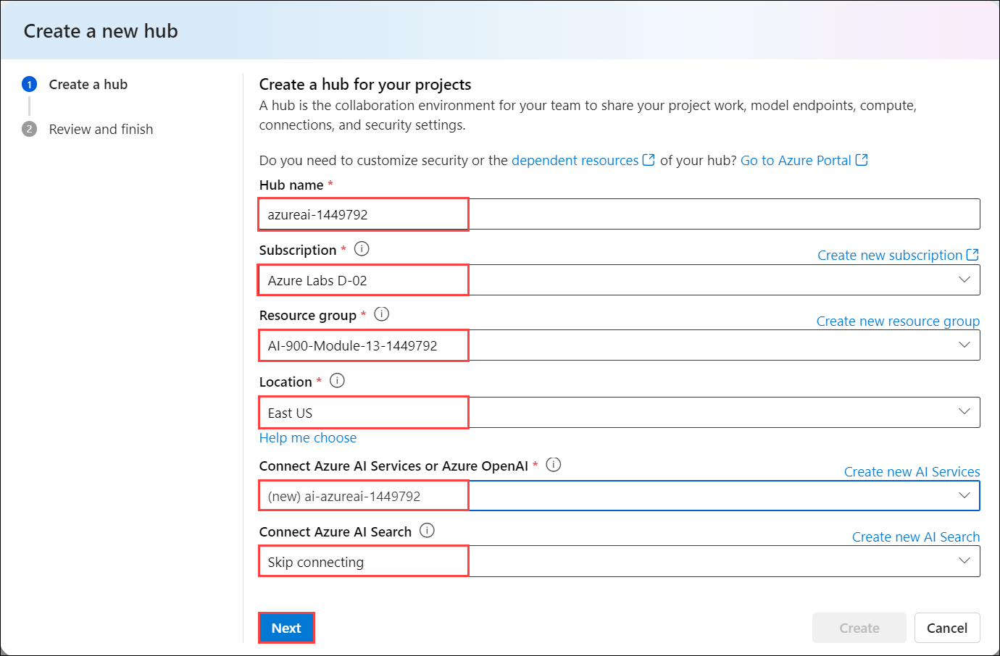

    | Setting | Action |
    | -- | -- |
    | **Hub name** | **azureai-<inject key="DeploymentID" enableCopy="false"/>** |
    | **Subscription** | *Default Azure subscription* |
    | **Resource Group** | **AI-900-Module-13-<inject key="DeploymentID" enableCopy="false" />** |
    | **Location** | **East US** |
    | **Connect Azure AI Services or Azure OpenAI** | *create a new AI Services **ai-azureai-<inject key="DeploymentID" enableCopy="false" />*** |
    | **Connect Azure AI Search** | *Skip connecting* |

    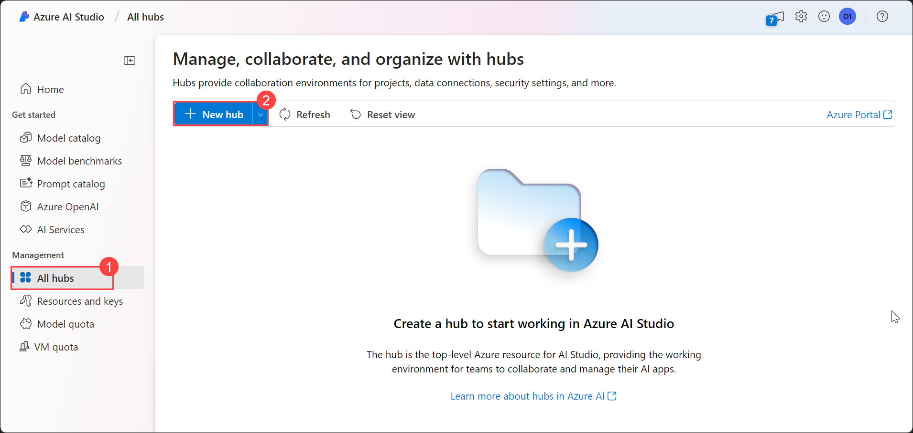

    > \* Azure OpenAI resources are constrained at the tenant level by regional quotas. The listed regions include default quota for the model type(s) used in this exercise. Randomly choosing a region reduces the risk of a single region reaching its quota limit in scenarios where you are sharing a tenant with other users. In the event of a quota limit being reached later in the exercise, there's a possibility you may need to create another resource in a different region.

2. Review your details and click on **Create**.

    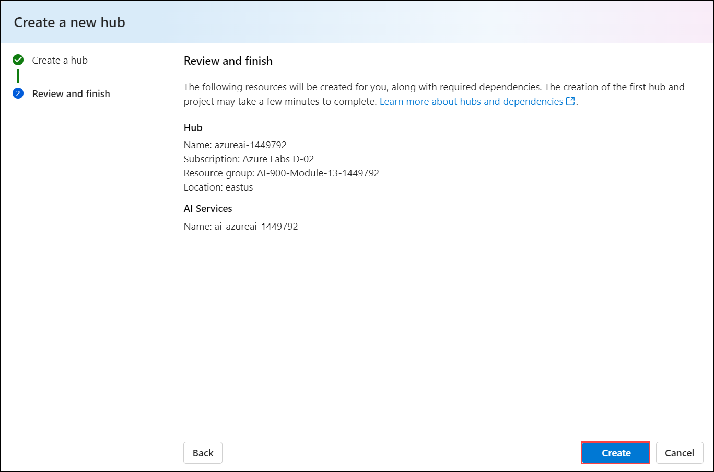

3. After the Azure AI hub has been created, it should look similar to the following image:

    

4. Open a new browser tab (leaving the Azure AI Studio tab open) and browse to the Azure portal.

5. Browse to the resource group **AI-900-Module-13-<inject key="DeploymentID" enableCopy="false" />** , and view the Azure resources that have been created.

    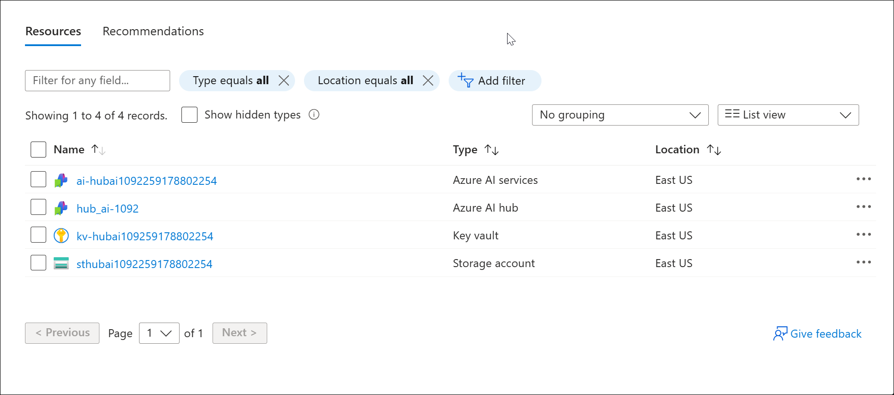

6. Return to the Azure AI Studio browser tab.

7. View each of the pages in the pane on the left side of the page for your Azure AI hub, and note the artifacts you can create and manage. On the **Connections** page, observe that connections to Azure OpenAI and AI services have already been created.

    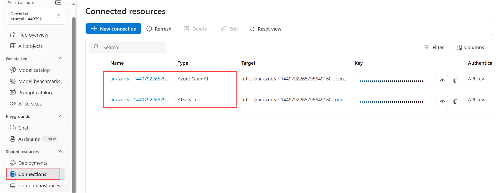

### Task 3: Create a project

An Azure AI hub provides a collaborative workspace within which you can define one or more *projects*. Let's create a project in your Azure AI hub.

1. In Azure AI Studio, ensure you're in the hub you just created (you can verify your location by checking the path at the top of the screen).

2. Navigate to **All projects (1)** using the menu on the left, Select **+ New project (2)**.

    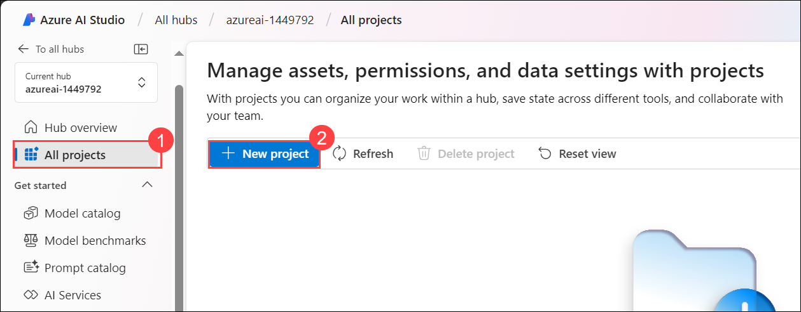

3. In the **Create a project** wizard, create a project with the following settings, and then click **Create a project** to proceed

    - **Current hub**: **azureai-<inject key="DeploymentID" enableCopy="false"/>**
    - **Project name**: **ai-project-<inject key="DeploymentID" enableCopy="false"/>**

    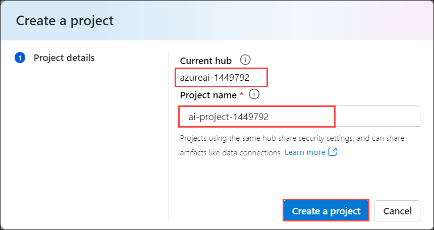

4. Wait for your project to be created. When it's ready, it should look similar to the following image:

    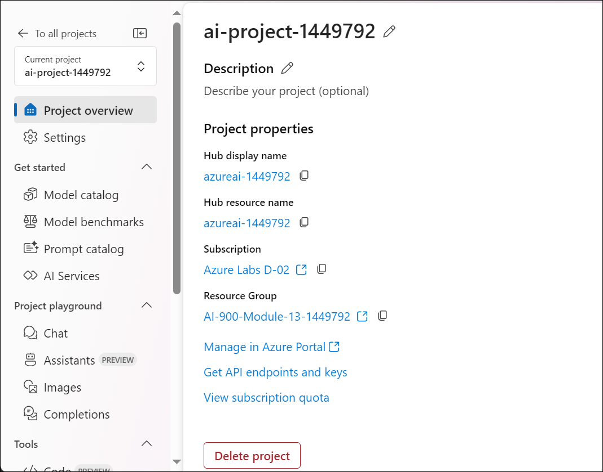

5. View the pages in the pane on the left side, expanding each section, and note the tasks you can perform and the resources you can manage in a project.

### Task 4: Deploy and test a model

You can use a project to create complex AI solutions based on generative AI models. A full exploration of all of the development options available in Azure AI Studio is beyond the scope of this exercise, but we'll explore some basic ways in which you can work with models in a project.

1. In the pane on the left for your project, in the **Shared resources** section, select the **Deployments** page.

2. On the **Deployments (1)** page, under the **Model deployments** tab, click **+ Deploy model (2)**, and then select **Deploy base model (3)**.

    

3. Search for the **gpt-35-turbo** model from the list, select and confirm.

    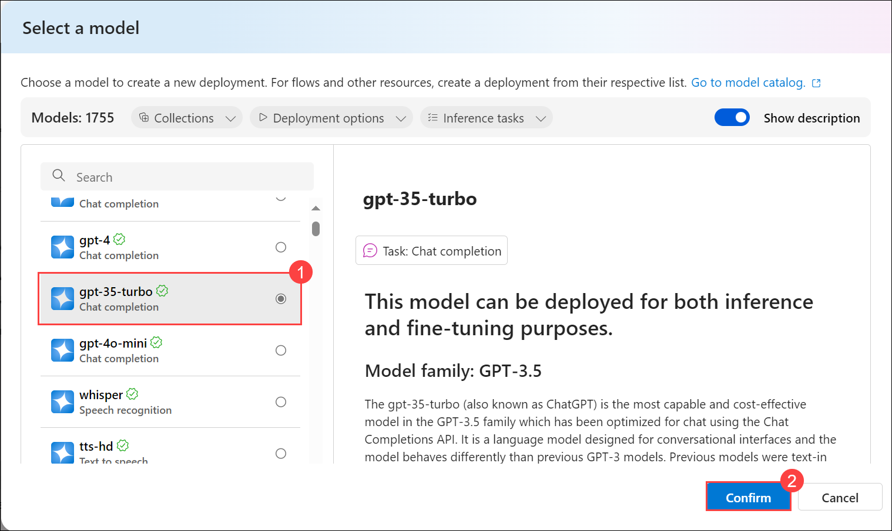

4. Enter **gpt-35-turbo** as your **Deployment name**, then click on **Customize** to adjust the other values accordingly.

    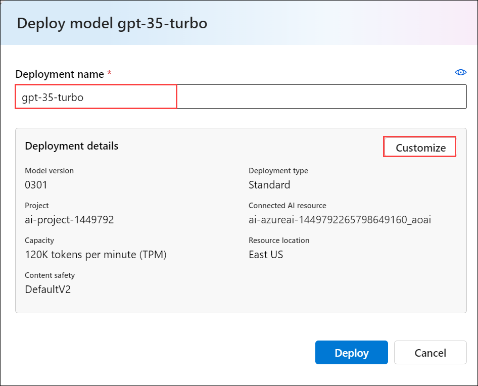

5. Deploy the model with the following settings:

    | Setting | Action |
    | -- | -- |
    | **Connected Azure OpenAI resource** | *Select the default connection that was created when you created your hub* |
    | **Model version** | *Select the default version* |
    | **Deployment type** | **Standard** |
    | **Tokens per Minute Rate Limit (thousands)** | **5K** |
    | **Content filter** | **Default** |
    | **Enable dynamic quota** | **Disable** |

    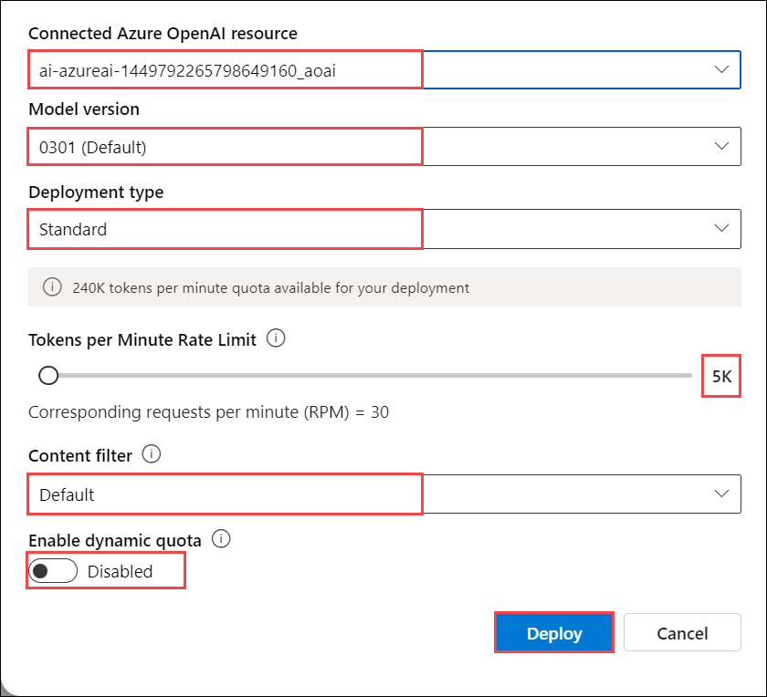

    > **Note**: Reducing the TPM helps avoid over-using the quota available in the subscription you are using. 5,000 TPM is sufficient for the data used in this exercise.

6. After the model has been deployed, in the deployment overview page, select **Open in playground**.

    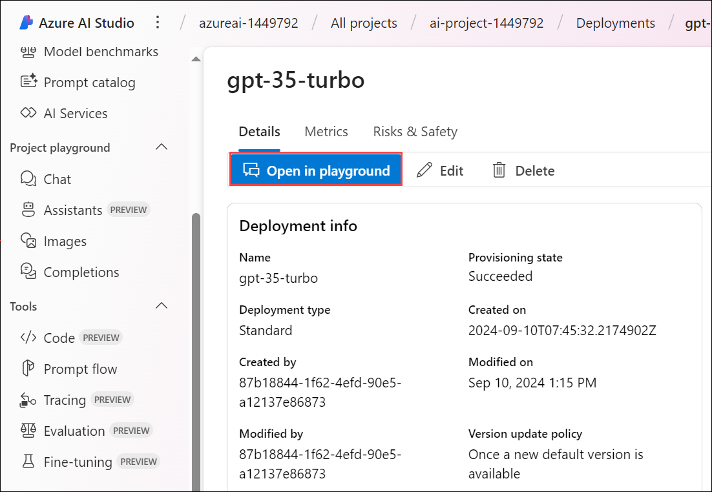

7. In the **Chat playground** page, ensure that your model deployment is selected in the **Deployment** section.

8. In the chat window, enter a query such as *What is AI?* and view the response:

    

## Validation

> **Congratulations** on completing the task! Now, it's time to validate it. Here are the steps:
 
- Navigate to the Lab Validation Page, from the upper right corner in the lab guide section.
- Hit the Validate button for the corresponding task. If you receive a success message, you can proceed to the next task. 
- If not, carefully read the error message and retry the step, following the instructions in the lab guide.
- If you need any assistance, please contact us at labs-support@spektrasystems.com. We are available 24/7 to help you out.

### Review

## You have successfully completed this lab.
