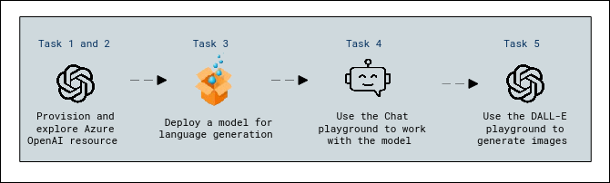
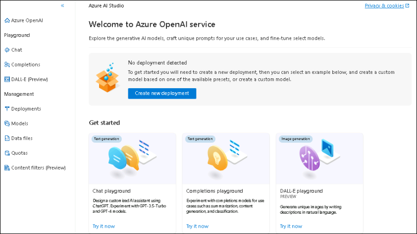
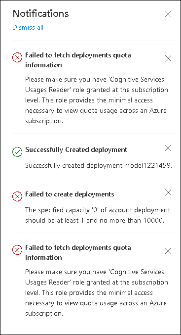
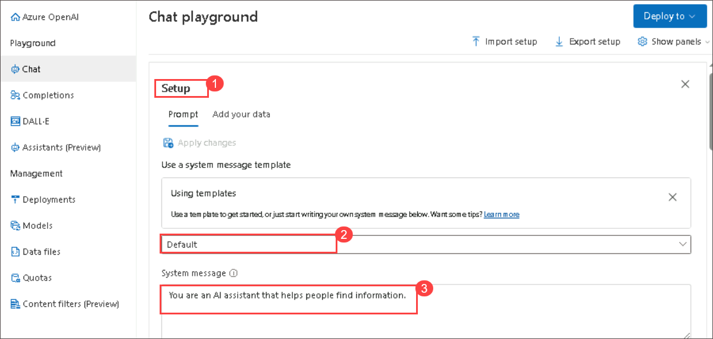
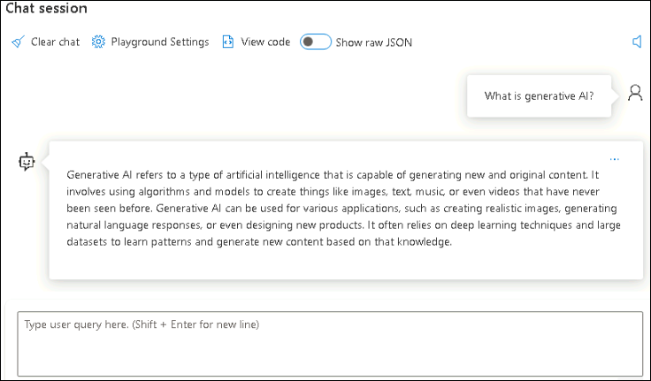
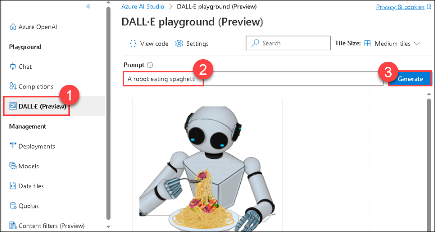

# Module 13: Explore Azure OpenAI Service

## Lab overview

In this exercise, you'll explore Azure OpenAI Service and use it to deploy and experiment with generative AI models.
Azure OpenAI Service brings the generative AI models developed by OpenAI to the Azure platform, enabling you to develop powerful AI solutions that benefit from the security, scalability, and integration of services provided by the Azure cloud platform.

## Lab objectives

In this lab, you will perform:
- Task 1: Provision an Azure OpenAI resource
- Task 2: Explore Azure OpenAI Studio
- Task 3: Deploy a model for language generation
- Task 4: Use the *Chat* playground to work with the model
- Task 5: Use the *DALL-E* playground to generate images

## Estimated timing: 45 minutes

## Architecture Diagram



## Exercise 1: Explore Azure OpenAI Service

### Task 1: Provision an Azure OpenAI resource

1. In azure portal, search for **Azure OpenAI** and click on **+ Create** resource with the following settings:

    - **Subscription**: Select your **existing azure subscription**.
    - **Resource group**: Select **AI-900-Module-13-<inject key="DeploymentID" enableCopy="false" />**
    - **Region**: Select **east us**
    - **Name**: Enter **openai<inject key="DeploymentID" enableCopy="false" />**
    - **Pricing tier**: Standard S0

2. Click **Next** thrice and Click on **Create**.

   >**Note:** Different regions have different availability and quota for models. In this exercise, you'll be using a GPT-35-Turbo model for text generation and a DALL-E model for image generation, both of which are supported in the East US.

3. Wait for deployment to complete. Then you can go to the deployed Azure OpenAI resource in the Azure portal.

### Task 2: Explore Azure OpenAI Studio

You can deploy, manage, and explore models in your Azure OpenAI Service by using Azure OpenAI Studio.

1. On the **Overview** page for your Azure OpenAI resource, click on the **Go to Azure OpenAI Studio** button to open Azure OpenAI Studio in a new browser tab. Alternatively, navigate to [Azure OpenAI Studio](https://oai.azure.com/) directly.

    When you first open Azure OpenAI Studio, it should look similar to this:

    

1. View the pages available in the pane on the left. You can always return to the home page at the top. Additionally, OpenAI Studio provides multiple pages where you can:
    - Experiment with models in a *playground*.
    - Manage model deployments and data.

### Task 3: Deploy a model for language generation

To experiment with natural language generation, you must first deploy a model.

1. On the **Models** page view the available models in your Azure OpenAI service instance.
1. Select any of the **gpt-35-turbo** models for which the **Deployable** status is **Yes**, and then select **Deploy**:

    

1. Create a new deployment with the following settings:
    - **Model**: gpt-35-turbo(1)
    - **Model version**: Auto-update to default(2)
    - **Deployment name**: **model<inject key="DeploymentID" enableCopy="false" />**(3)
    - **Advanced options**
        - **Content filter**: Default (4)
        - **Deployment type**: Standard (5)
        - **Tokens per minute rate limit**: 5K (6)
        - **Enable dynamic quota**: Enabled (7)
        - Click **Crete** (8)
    >  A rate limit of 5,000 tokens per minute is more than adequate to complete this exercise while leaving capacity for other people using the same subscription.
    
      

     >**Note**: Please avoid any failure error messages you may encounter as indicated below and try to deploy the model again:

      

### Task 4: Use the *Chat* playground to work with the model

Now that you have deployed a model, you can use it in the *Chat* playground to generate natural language output from prompts that you submit in a chat interface.

1. In [Azure OpenAI Studio](https://oai.azure.com/), navigate to the **Chat** playground in the left pane.

    The *Chat* playground provides a chatbot interface with which you can interact with your deployed model, as shown here:

    .png)

1. Ensure that your model deployment is selected from the right navigation in the **Configuration** pane.

1. In the **Setup** pane, select the **Default** system message template, and view the system message this template creates. The system message defines how the model will behave in your chat session. Click on **Save changes** on the top.

   
   
1. In the **Chat session** section (you may need to scroll down), enter the following user message.

    ```
   What is generative AI?
    ```

1. Observe the output returned by the model, which should provide a definition of generative AI.

   
   
1. Enter the following user message as a follow-up question:

    ```
   What are three benefits it provides?
    ```

1. Review the output, noting that the chat session has kept track of the previous input and response to provide context (so it correctly interprets "it" as referring to "generative AI") and that it provides a suitable response based on what was requested (it should return three benefits of generative AI).

### Task 5: Use the *DALL-E* playground to generate images

In addition to language generation models, Azure OpenAI Service supports the DALL-E 2 model for image generation.

> **Note**: You must have applied for and received access to DALL-E functionality in your Azure OpenAI service access application to complete this section of the exercise.

1. In [Azure OpenAI Studio](https://oai.azure.com/), navigate to the **DALL-E** playground in the left pane.
1. Enter the following prompt:

    ```
    A robot eating spaghetti
    ```

1. Select **Generate** and view the results, which should consist of an image based on the description you provided in the prompt, similar to this:

    

1. Generate a second image by modifying the prompt to:

    ```
    A robot eating spaghetti in the style of Rembrandt
    ```
1. Verify that the new image matches the requirements of the prompt, similar to this:

    .png)

## Validation

<validation step="7a610c9e-f8af-43f8-92f1-357e933d8a8d" />

> **Congratulations** on completing the task! Now, it's time to validate it. Here are the steps:
 
- Navigate to the Lab Validation Page, from the upper right corner in the lab guide section.
- Hit the Validate button for the corresponding task. If you receive a success message, you can proceed to the next task. 
- If not, carefully read the error message and retry the step, following the instructions in the lab guide.
- If you need any assistance, please contact us at labs-support@spektrasystems.com. We are available 24/7 to help you out.

### Review

In this lab, you have provisioned and explored the azure openAI resource, deployed a model for language generation, used the *Chat* playground and the *DALL-E* playground to work with the model and generate images respectively.

## You have successfully completed this lab.
