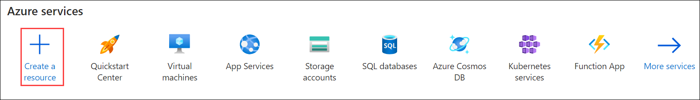
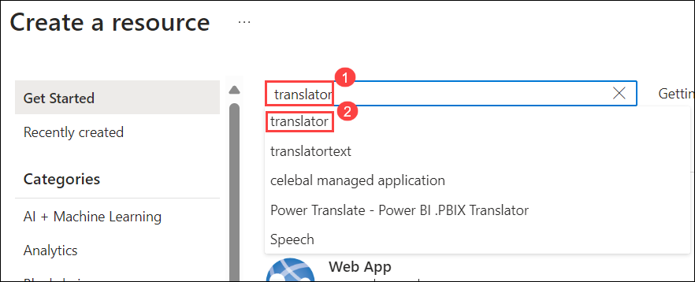
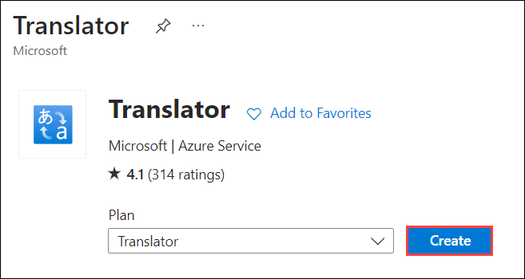
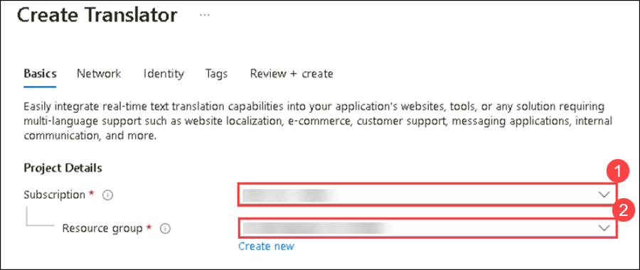
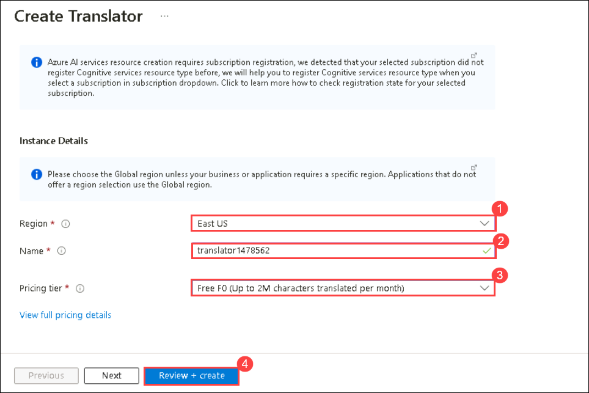
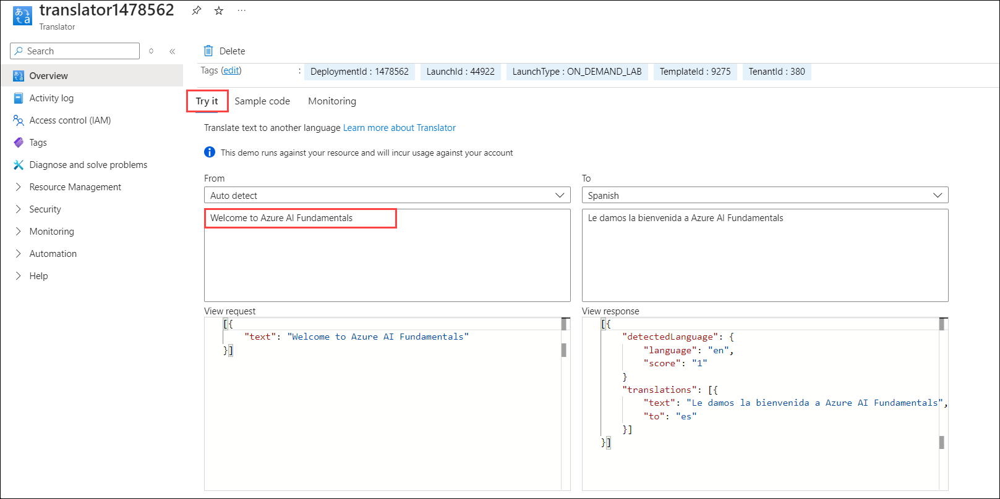
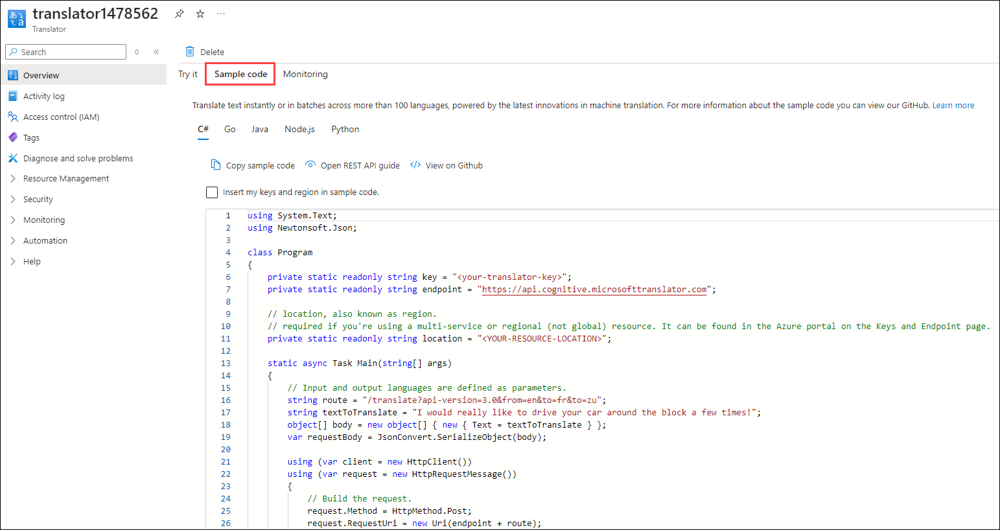
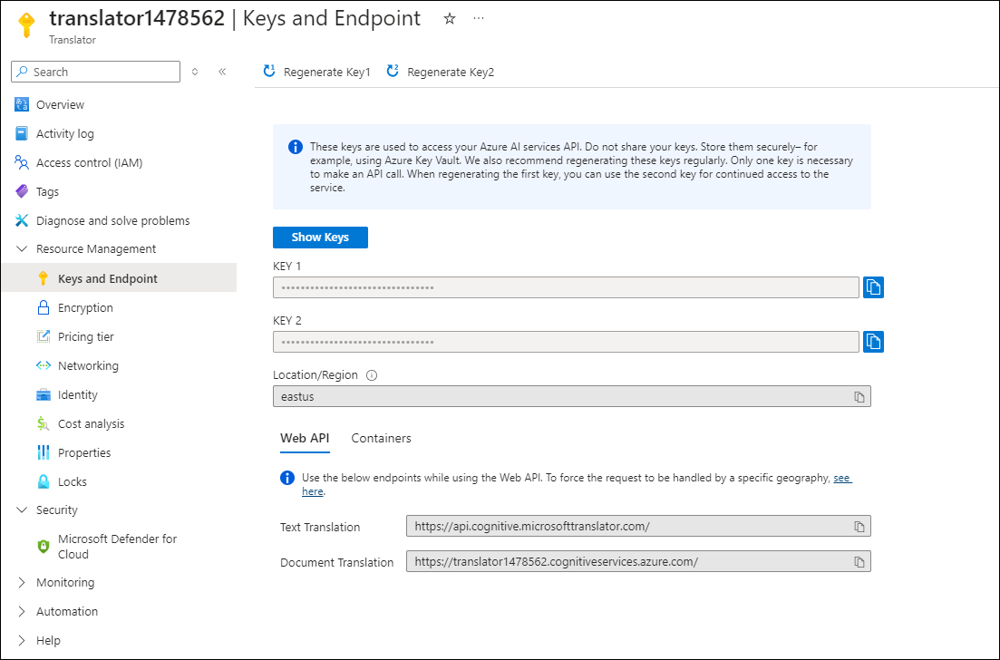

# Module 15: Explore Azure AI Translator

Artificial Intelligence (AI) can help simplify translation between languages, helping to remove barriers to communication across countries and cultures.

To test the capabilities of the Azure AI Translator service, we'll take a look at it in action in the Azure Portal. The same principles and functionality apply in real-world solutions, such as websites or phone apps.

## Create a *Translator* resource

You can use the Translator service by creating either a **Translator** resource or an **Azure AI services** resource.

For this exercise, create a **Translator** resource in your Azure subscription.

1. In azure portal, select **+ Create a resource**.

    

1. In the Marketplace page search for **Translator** and Select **Translator**.
 
   

1. On **Translator** Page Click on **Create**.

   
  
1. You will be taken to a page to create a Translator resource. Configure it with the following settings:

    - **Subscription**: **Use existing Azure subscription (1)**.
    - **Resource group**: Select **AI-900-Module-15-<inject key="DeploymentID" enableCopy="false" /> (2)**
   
      

    - **Region**: **<inject key="location" enableCopy="false"/>(1)**
    - **Name**: Enter **translator<inject key="DeploymentID" enableCopy="false" />(2)**
    - **Pricing tier**: Free F0 **(3)**
    - Click on **Review and create (4)**.

      

1.Wait for deployment to complete. Then go to the deployed resource.

## Explore Translator service 

We can explore the capabilities of the Translator service in the Azure Portal. 

1. In the Azure portal, in the deployed resource, review the *Overview* page.

1. In the *Try it* section of the Overview page, under the *From: Auto detect* section, type the text `Welcome to Azure AI Fundamentals`. Notice the JSON that appears in correspondence in the *View request* section. 

1. In the *View response* section, view the JSON. Behind the scenes, a *request* has been sent to the Translator service. The *response* includes the detected source language with a confidence score, a translation using the alphabet of the output language, and an output language code. 

   

1. The demo in the *Try it* section shows what it would look like if you created a simple translation application with a user interface. In the case of the demo, as soon as you type in text, a request is made to the Translator service. How could you make this request? Check out the *Sample Code* tab. Here you see examples of code in different programming languages that could be used to make the request.

   

1. Identify the lines in the code samples where you need to include your Translator service's **Key** and **Endpoint**. With your key and endpoint, you would be able to send a request to the Translator service, and receive a response like you saw in the demo.

   

1. Navigate to the left hand menu. Under *Resource Management*, select *Keys and Endpoint*. If you were to build an application, you would find your key and endpoint here. 

## Learn more

To learn more about what you can do with this service, see the [Translator page](https://learn.microsoft.com/en-us/azure/ai-services/translator/translator-overview).
