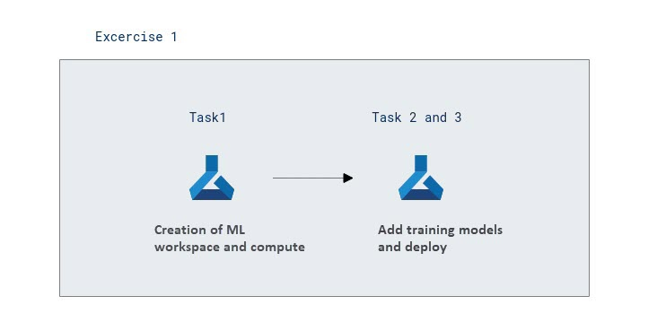

# Lab Scenario Preview: Module 01: Explore Automated Machine Learning in Azure Machine Learning

## Lab overview

In this exercise, you'll use the automated machine learning feature in **Azure Machine Learning** to train and evaluate a machine learning model. You'll then deploy and test the trained model.

## Lab objectives

In this lab, you will perform:

- Creating an *Azure Machine Learning workspace* resource
- Use automated machine learning to train a model

## Estimated timing: 60 minutes

## Solution Architecture

Once you understand the lab's content, you can start the Hands-on Lab by clicking the **Launch** button located in the top right corner. This will lead you to the lab environment and guide. You can also preview the full lab guide [here](https://experience.cloudlabs.ai/#/labguidepreview/1c4e71ee-a835-416f-8c97-185cec7bee07)
if you want to go through detailed guide prior to launching lab environment.  
