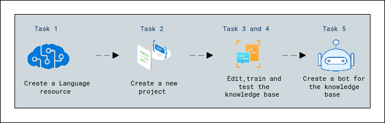

# Lab Scenario Preview: Module 07: Use Question Answering model with Language Studio

## Lab overview
In this exercise you will use Language Studio to create and train a knowledge base of question and answers that will be used by a customer services bot. Content for the knowledge base will come from an existing FAQ page from the web site of Margie’s Travel, a fictitious travel agency. You will then use Language Studio to see how it would work when used by customers.

When implementing a bot, the first step is to create a knowledge base of question and answer pairs. This is used together with built-in natural language processing capabilities so that the bot can interpret questions and find the most appropriate answer for the user.

Azure AI Language includes *question answering* capabilities, which you will use to create a knowledge base. Knowledge bases can be created either by entering question and answer pairs manually, or from an existing document or web page. Margie’s Travel wants to use their existing FAQ document.

The Language service's question answering feature enables you to quickly create a knowledge base, either by entering question and answer pairs or from an existing document or web page. It can then use some built-in natural language processing capabilities to interpret questions and find appropriate answers.

## Lab objectives
In this lab, you will perform:

- Create a *Language* resource
- Create a new project
- Edit the knowledge base
- Train and test the knowledge base
- Create a bot for the knowledge base

## Estimated timing: 45 minutes

## Solution Architecture

Once you understand the lab's content, you can start the Hands-on Lab by clicking the **Launch** button located in the top right corner. This will lead you to the lab environment and guide. You can also preview the full lab guide [here](https://experience.cloudlabs.ai/#/labguidepreview/b18e8940-a0a3-4155-a8c8-6dcc77b1fe5a)
if you want to go through detailed guide prior to launching lab environment.  
