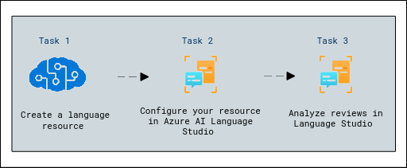

# Lab Scenario Preview: Module 08: Use Conversational Language Understanding with Language Studio

## Lab overview
Increasingly, we expect computers to be able to use AI to understand natural language commands, either spoken or typed. For example, you might want a home automation system to control devices in your home by using voice commands such as “switch on the light” or “put the fan on.” AI-powered devices can understand these commands and take appropriate action.

In this exercise, you will use Language Studio to create and test a project that sends instructions to devices such as lights or fans. You’ll use the capabilities of the Conversational Language Understanding service to configure your project. 

## Lab objectives

In this lab, you will perform:

- Create a *Language* resource
- Create a Conversational Language Understanding App
- Create intents, utterances, and entities
- Train the model
- Deploy and test the model

## Estimated timing: 45 minutes

## Solution Architecture

Once you understand the lab's content, you can start the Hands-on Lab by clicking the **Launch** button located in the top right corner. This will lead you to the lab environment and guide. You can also preview the full lab guide [here](https://experience.cloudlabs.ai/#/labguidepreview/5337af06-1962-4179-a751-8ba77875d9b6)
if you want to go through detailed guide prior to launching lab environment.  

