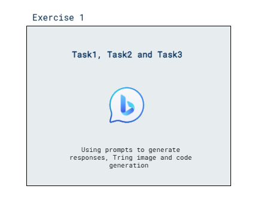

# Lab Scenario Preview: Module 12: Explore generative AI with Bing

## Lab overview

In this exercise you will explore generative AI with Bing Copilot. 

## Lab objectives
In this lab, you will perform:
- Using AI with Bing Copilot prompts to generate responses
- Trying image generation using AI with Bing Copilot
- Trying code generation using AI with Bing Copilot
  
## Estimated timing: 30 minutes

## Solution Architecture

 

